# VDX Installer — Data Model & Schema Relationships

**Companion to:** `2026-05-01-vdx-installer-design.md`
**Scope:** Visual representations of data structures, their relationships, lifecycles, and on-disk representations. This is the "shape of the data" view of the system, complementing the behavioral view in `2026-05-01-vdx-installer-flows.md`.

---

## 1. Schema entity relationships

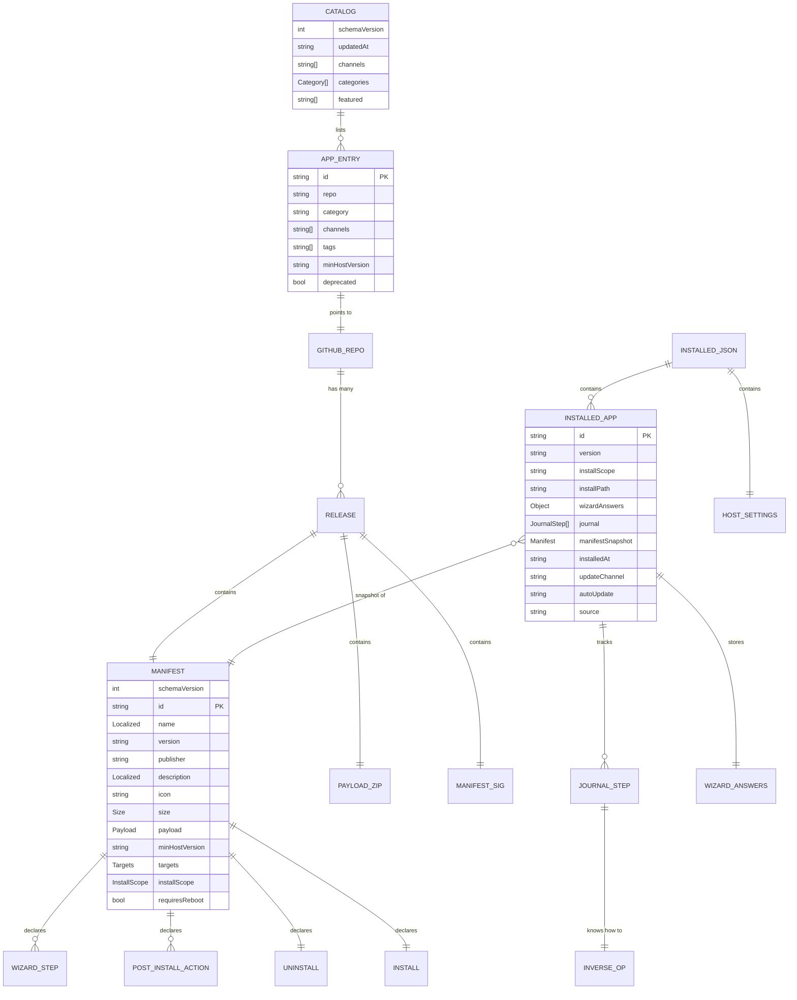

---

## 2. Manifest internal structure

```mermaid
graph TB
    Man[manifest.json] --> Meta[metadata]
    Man --> Pay[payload<br/>filename + sha256]
    Man --> Targets[targets<br/>os, arch, minOsBuild]
    Man --> Scope[installScope<br/>supports, default]
    Man --> Wiz[wizard array]
    Man --> Inst[install]
    Man --> Post[postInstall array]
    Man --> Un[uninstall]

    Wiz --> WL[license]
    Wiz --> WP[path]
    Wiz --> WC[checkboxGroup]
    Wiz --> WS[select]
    Wiz --> WT[text]
    Wiz --> WSm[summary]

    Inst --> Ext[extract array<br/>from, to, when]

    Post --> PSc[shortcut]
    Post --> PR[registry]
    Post --> PE[envPath]
    Post --> PX[exec - allowedHashes]

    Un --> UR[removePaths]
    Un --> URg[removeRegistry]
    Un --> USc[removeShortcuts]
    Un --> UEnv[removeEnvPath]
    Un --> UPre[preExec]

    classDef container fill:#eef6ff,stroke:#3b82f6;
    classDef wizard fill:#fef3c7,stroke:#f59e0b;
    classDef action fill:#fee2e2,stroke:#dc2626;
    class Wiz container
    class WL,WP,WC,WS,WT,WSm wizard
    class PSc,PR,PE,PX action
```

---

## 3. Trust artifact relationships

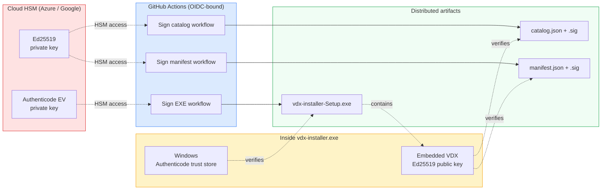

---

## 4. installed.json layout

```mermaid
graph TB
    Root[installed.json] --> Schema[schema: 1]
    Root --> Host[host: { version }]
    Root --> Last[lastCatalogSync]
    Root --> Settings[settings]
    Root --> Apps[apps map]

    Settings --> SLang[language]
    Settings --> SChan[updateChannel]
    Settings --> SAuto[autoUpdateHost / Apps]
    Settings --> SCache[cacheLimitGb]
    Settings --> SProxy[proxy]
    Settings --> STel[telemetry]
    Settings --> STray[trayMode]
    Settings --> SDev[developerMode]

    Apps --> A1[com.samsung.vdx.exampleapp]
    Apps --> A2[com.samsung.vdx.anotherapp]
    Apps --> A3[...]

    A1 --> AVer[version]
    A1 --> AScope[installScope]
    A1 --> APath[installPath]
    A1 --> AAns[wizardAnswers]
    A1 --> AJ[journal array]
    A1 --> AMan[manifestSnapshot]
    A1 --> AAt[installedAt]
    A1 --> AAu[autoUpdate]
    A1 --> ASrc[source]

    AJ --> J1[extract step]
    AJ --> J2[shortcut step]
    AJ --> J3[registry step]
    AJ --> J4[envPath step]
```

---

## 5. Filesystem layout (full)

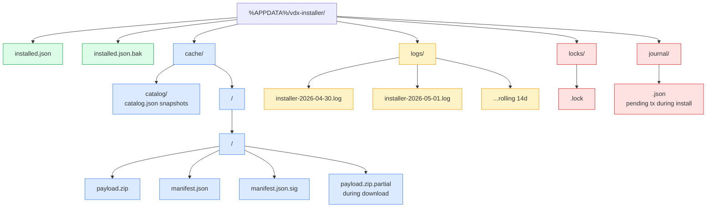

Plus the app's own install destination (e.g., `%LocalAppData%\Programs\Samsung\<App>` or `C:\Program Files\Samsung\<App>` per scope) which is *outside* this directory tree.

---

## 6. Wizard answer types

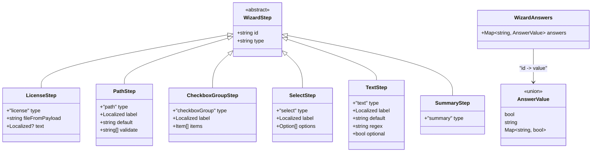

---

## 7. Post-install action types

```mermaid
classDiagram
    class PostInstallAction {
        <<abstract>>
        +string type
        +string? when
    }

    class ShortcutAction {
        +"shortcut" type
        +"desktop|startMenu|programs" where
        +string target
        +string name
        +string? args
    }

    class RegistryAction {
        +"registry" type
        +"HKCU|HKLM" hive
        +string key
        +Map~string, RegValue~ values
    }

    class EnvPathAction {
        +"envPath" type
        +"user|machine" scope
        +string add
    }

    class ExecAction {
        +"exec" type
        +string cmd
        +string[] args
        +int timeoutSec
        +string[] allowedHashes
    }

    PostInstallAction <|-- ShortcutAction
    PostInstallAction <|-- RegistryAction
    PostInstallAction <|-- EnvPathAction
    PostInstallAction <|-- ExecAction

    class JournalStep {
        +string type
        +Object inverse
    }

    ShortcutAction --> JournalStep : "creates inverse: delete shortcut"
    RegistryAction --> JournalStep : "creates inverse: restore prev value"
    EnvPathAction --> JournalStep : "creates inverse: remove entry"
    ExecAction --> JournalStep : "creates record (no inverse)"
```

---

## 8. State transitions: an installed app over time

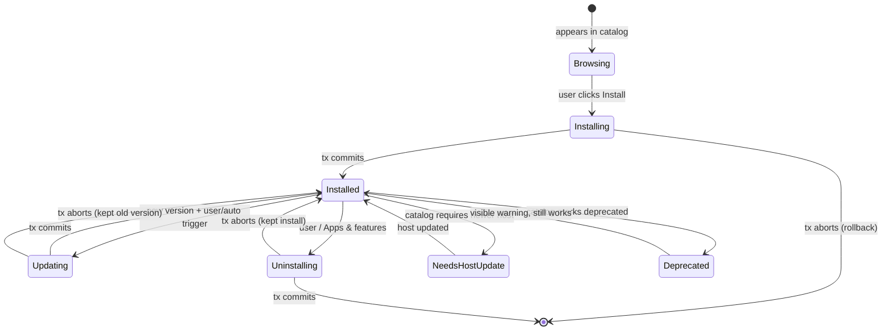

---

## 9. Mapping: manifest fields → effects on system

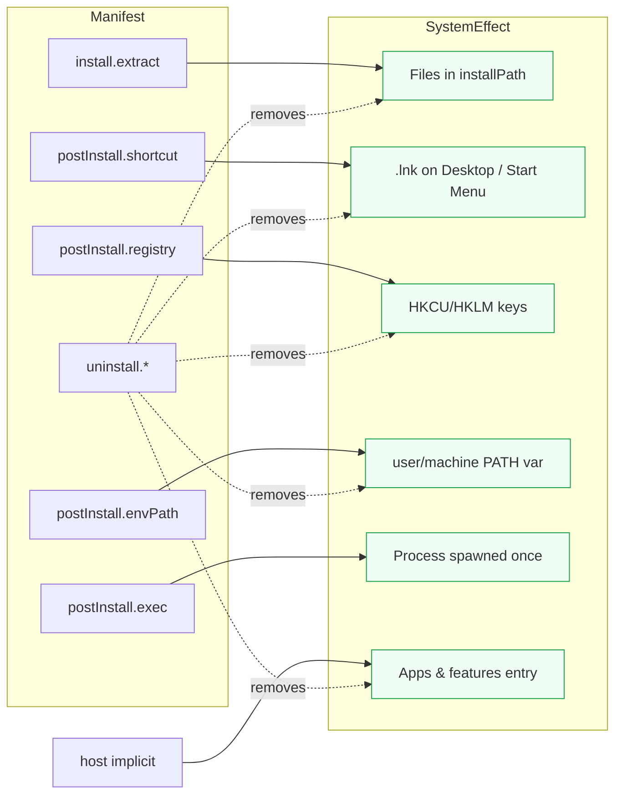

---

## 10. IPC channels and zod schemas

```mermaid
graph LR
    subgraph SharedSchemas[shared/ipc.ts]
        S1[CatalogListReq/Res]
        S2[CatalogRefreshReq/Res]
        S3[InstallPrepareReq/Res]
        S4[InstallRunReq/Res]
        S5[InstallProgressEvent]
        S6[UpdateCheckReq/Res]
        S7[UpdateRunReq/Res]
        S8[UninstallRunReq/Res]
        S9[SettingsGetReq/Res]
        S10[SettingsSetReq/Res]
        S11[AuthSetTokenReq/Res]
        S12[AuthClearTokenReq/Res]
        S13[DiagExportReq/Res]
        S14[DiagOpenLogsReq/Res]
        S15[CatalogUpdatedEvent]
        S16[UpdateAvailableEvent]
    end

    subgraph Renderer[Renderer typed client]
        RC[ipc client]
    end
    subgraph Main[Main typed handler]
        MH[ipc server]
    end

    RC -. zod-validates request .- SharedSchemas
    MH -. zod-validates request .- SharedSchemas
    RC -- IPC --> MH
    MH -- IPC --> RC

    classDef schema fill:#fef3c7,stroke:#f59e0b;
    class SharedSchemas schema
```

Channel naming convention: `<domain>:<verb>` for commands (`install:run`); past-tense events fired from main use `<domain>:<eventName>` (`catalog:updated`, `install:progress`).

---

## 11. Versioning of artifacts

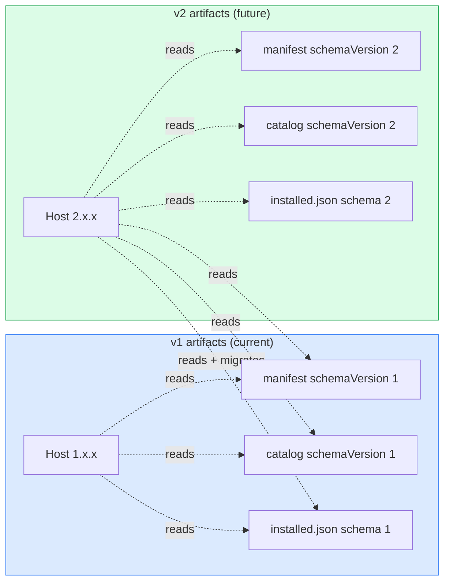

Compatibility commitment: a host of major version N reads manifests/catalogs from major version N-1 for at least one major-version cycle. installed.json is migrated forward in place; never broken backwards.

---

## 12. Trust → action chain

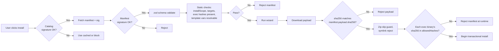

Every gate above must pass before the next; failure aborts cleanly with no system state changes.

---

## 13. Repos and their relationships

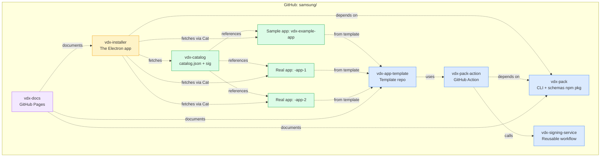

---

## 14. Settings keys → effects

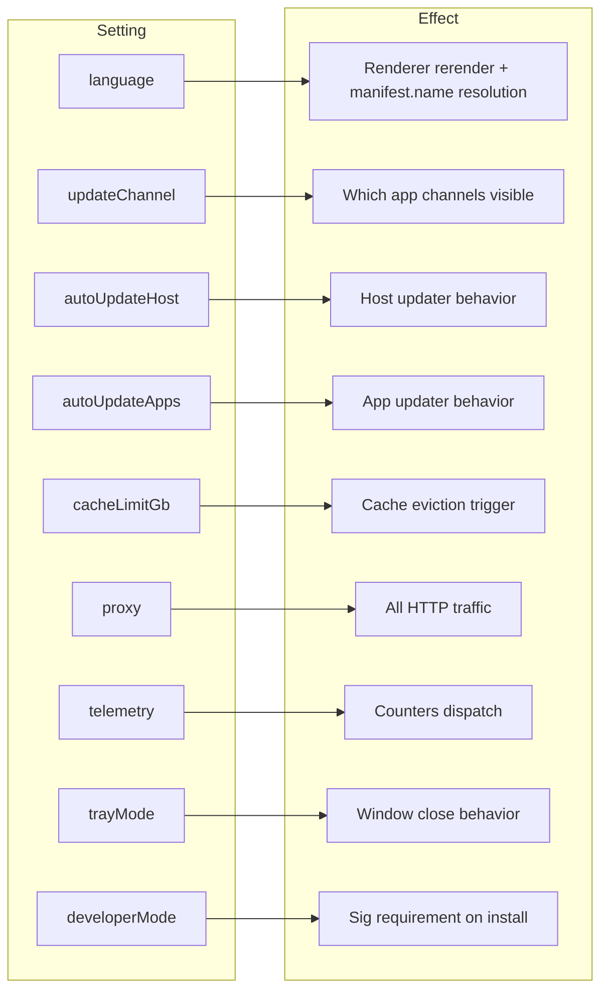

---

## Appendix — Schema source of truth

| Schema | Authoritative location |
|---|---|
| Manifest v1 | `samsung/vdx-pack/schemas/manifest-v1.json` (also published at `https://vdx.samsung.com/schema/manifest-v1.json`) |
| Catalog v1 | `samsung/vdx-pack/schemas/catalog-v1.json` |
| installed.json v1 | `samsung/vdx-installer/src/shared/state-schema.ts` (zod) |
| IPC contracts | `samsung/vdx-installer/src/shared/ipc.ts` (zod) |
| Journal step | `samsung/vdx-installer/src/main/engine/transaction.ts` (zod) |

All zod-defined schemas are exported as JSON Schema for editor completion via `pnpm export-schemas`.
