# VDX Installer — Design Specification

**Status:** Draft v1
**Date:** 2026-05-01
**Owner:** Samsung VDX team
**Audience:** Installer engineers, app team developers, IT operators

**Companion documents:**
- [`2026-05-01-vdx-installer-flows.md`](./2026-05-01-vdx-installer-flows.md) — detailed sequence/flow diagrams for each test scenario and runtime path.
- [`2026-05-01-vdx-installer-data-model.md`](./2026-05-01-vdx-installer-data-model.md) — entity-relationship, class, state, and filesystem-layout diagrams of all data artifacts.
- The visual product design (UI mockups) is in `vdx-installer.html` at the project root.

---

## 1. Overview

VDX Installer is a Windows-native, Electron-based "one installer" that lets users browse, install, update, and remove a curated catalog of Samsung apps from a single application — replacing the need for each app to ship its own installer EXE.

It draws inspiration from UAD Connect, Native Access, and similar plugin/app managers used in pro-audio. Each app declares its installation flow (wizard steps, file placement, post-install actions) through a signed `manifest.json`. The installer interprets that manifest and runs the entire flow inside its own UI, with no separate installer process for individual apps.

### 1.1. Goals

- **Single user-facing installer** for many Samsung Windows apps.
- **No per-app installer EXE required** — wizard steps, registry, shortcuts, PATH, services, and post-install commands are all expressible in a declarative manifest.
- **Auto-update** for both the installer itself and every installed app.
- **Low onboarding friction for app teams** — a template repo + CLI + AI-assistant rules let an app be packaged with minimal manual work.
- **Trustworthy** — code-signed installer, signed manifests, hash-pinned exec actions, transactional install with rollback.
- **Distribution via GitHub Releases** initially; architecture should not preclude swapping the source later.

### 1.2. Non-goals (v1)

- **macOS / Linux** support. Windows only.
- **Cross-app dependencies** (app A requires app B). Each app installs independently. Could be added in v2.
- **Mass-deployment / MSI for IT** (SCCM, Intune). Possible later, but v1 targets end-user installation.
- **Built-in payments / licensing**. Apps that need licensing handle it themselves.
- **Sandboxed app execution.** The installer installs apps; it does not run them in a sandbox.
- **Full app store browse experience** (reviews, ratings, screenshots gallery). v1 has a clean catalog with descriptions and one screenshot/icon.

### 1.3. Glossary

| Term | Meaning |
|---|---|
| **Host** | The VDX Installer application itself. |
| **App** | A Samsung product packaged for distribution via the installer. |
| **Manifest** | `manifest.json` — declarative description of an app's metadata, wizard flow, install actions, and uninstall. |
| **Payload** | `payload.zip` — the actual files to be placed on disk. |
| **Package** | Logical bundle of (manifest + payload + signature) attached to a GitHub Release. Uploaded as separate files — see §3.1. |
| **`.vdxpkg`** | Single-file zip of the same (manifest + sig + payload) for sideload — see §14. |
| **Catalog** | The curated list of apps available to a given user, served via `catalog.json`. |
| **Wizard** | The multi-step UI flow run before installing an app (license, path, options, summary). |
| **Action** | A declarative post-install operation (shortcut, registry, envPath, exec). |
| **Channel** | A release track such as `stable`, `beta`, or `internal`. |
| **Trust root** | Samsung-controlled Ed25519 public key embedded in the host; used to verify catalog and manifest signatures. |

---

## 2. Architecture

### 2.0. System overview

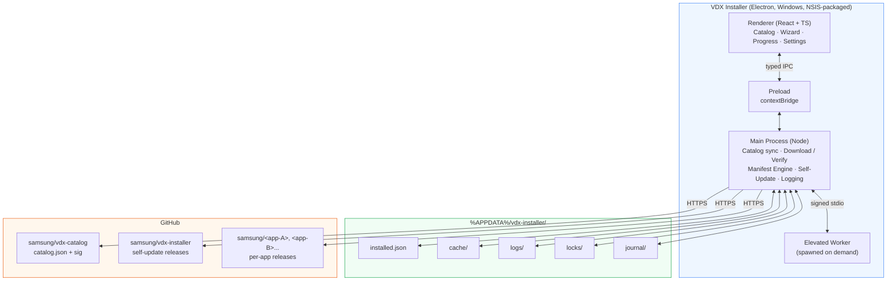

### 2.1. Process model

- **Main process**: Node-side. Owns the manifest engine, file/registry IO, network, state, updater, IPC server. Single instance enforced via mutex.
- **Renderer**: React/TS UI. No direct filesystem or network access — only via typed IPC.
- **Preload**: Minimal contextBridge that exposes the typed IPC client to the renderer.
- **Elevated worker** (`vdx-elevated-worker.exe`): Spawned on demand only when system-wide install / HKLM writes are needed. Communicates with main over a stdio channel. Idle process exits when work is done.

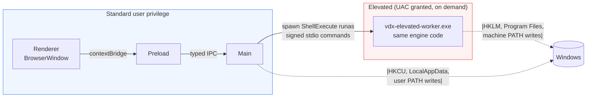

### 2.1.1. IPC channel surface (overview)

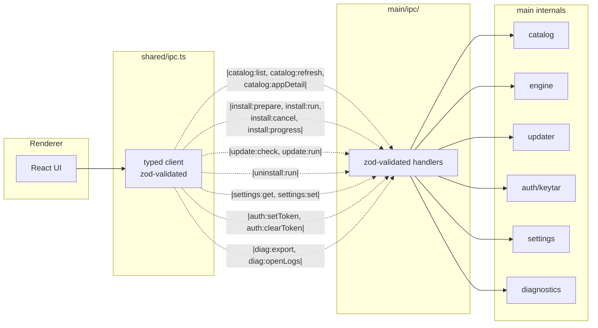

Every channel name has a zod request and response schema in `src/shared/ipc.ts`, validated on both ends. Renderer never reaches anything beyond what's in this surface — there is no general "fs" or "shell" exposure.

### 2.2. Trust boundaries

| Boundary | Trust assumption |
|---|---|
| Host EXE | Code-signed (Authenticode EV), trusted by Windows after first install. |
| Catalog | Signed with Samsung Ed25519 key; host has the public key embedded. |
| Manifest | Signed with same Samsung Ed25519 key (or a delegated key — see §6). |
| Payload | Hash recorded in manifest; verified after download. |
| Exec actions in manifest | Each binary's sha256 must be in `allowedHashes`; no shell. |
| User input (wizard) | Validated against manifest-declared regex/types; no eval. |
| Renderer | Untrusted in principle; cannot bypass IPC schema. |

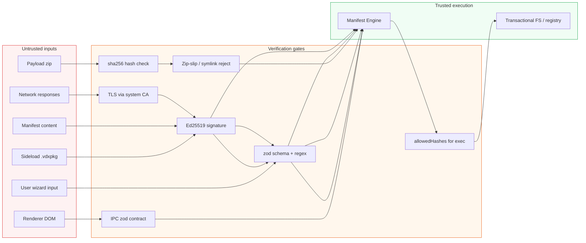

---

## 3. App Distribution: Manifest + Payload

### 3.0. End-to-end install sequence

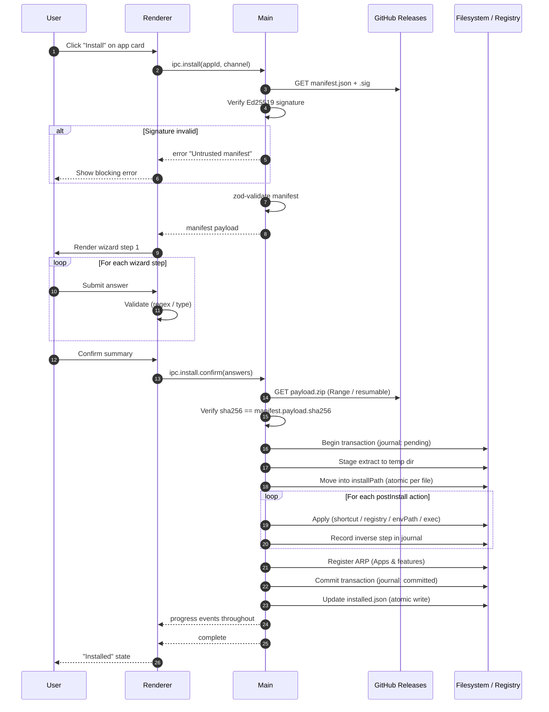

### 3.1. Release layout

A GitHub release for an app contains:

| Asset | Required | Notes |
|---|---|---|
| `manifest.json` | yes | Declarative description (§3.2). |
| `manifest.json.sig` | yes (production) | Detached Ed25519 signature. Required for non-developer-mode installs. |
| `payload.zip` | yes | Zip archive of files to be placed on disk. Hash recorded in manifest. |
| `icon.png` | recommended | 256×256 PNG; if absent, fallback to default icon. |
| `screenshots/*.png` | optional | Up to 4 screenshots shown in catalog detail view. |
| `EULA.txt` / `EULA.html` | conditional | Required when manifest declares a license step. |

The host pulls these via the GitHub Releases API. The release tag must follow semver (`v1.2.3`).

### 3.2. Manifest schema (v1)

```jsonc
{
  "schemaVersion": 1,
  "id": "com.samsung.vdx.exampleapp",
  "name": { "ko": "예제 앱", "en": "Example App", "default": "Example App" },
  "version": "1.2.3",
  "publisher": "Samsung",
  "description": { "ko": "...", "en": "...", "default": "..." },
  "icon": "icon.png",
  "screenshots": ["screenshots/01.png", "screenshots/02.png"],
  "homepage": "https://samsung.com/vdx/exampleapp",
  "supportUrl": "https://samsung.com/vdx/support",

  "license": {
    "type": "EULA",
    "file": "EULA.txt",
    "required": true
  },

  "size": {
    "download": 41200000,
    "installed": 89000000
  },

  "payload": {
    "filename": "payload.zip",
    "sha256": "abc123...",
    "compressedSize": 41200000
  },

  "minHostVersion": "1.0.0",
  "targets": {
    "os": "win32",
    "arch": ["x64"],
    "minOsBuild": 17763
  },

  "installScope": {
    "supports": ["user", "machine"],
    "default": "user"
  },

  "requiresReboot": false,

  "wizard": [
    { "type": "license", "id": "eula", "fileFromPayload": "EULA.txt" },
    {
      "type": "path",
      "id": "installPath",
      "label": { "ko": "설치 위치", "en": "Install location" },
      "default": "{ProgramFiles}/Samsung/ExampleApp",
      "validate": ["writable"]
    },
    {
      "type": "checkboxGroup",
      "id": "components",
      "label": { "ko": "구성 요소", "en": "Components" },
      "items": [
        { "id": "core",    "label": { "default": "Core" },          "default": true, "required": true },
        { "id": "samples", "label": { "default": "Sample assets" }, "default": true },
        { "id": "vstPath", "label": { "default": "Add VST3 path" }, "default": false }
      ]
    },
    {
      "type": "select",
      "id": "shortcut",
      "label": { "default": "Create shortcut" },
      "options": [
        { "value": "desktop+menu", "label": { "default": "Desktop + Start Menu" }, "default": true },
        { "value": "menu",         "label": { "default": "Start Menu only" } },
        { "value": "none",         "label": { "default": "None" } }
      ]
    },
    {
      "type": "text",
      "id": "deviceName",
      "label": { "default": "Device nickname (optional)" },
      "default": "",
      "optional": true,
      "regex": "^[A-Za-z0-9_-]{0,32}$"
    },
    { "type": "summary" }
  ],

  "install": {
    "extract": [
      { "from": "core/**",    "to": "{{installPath}}",         "when": "{{components.core}}" },
      { "from": "samples/**", "to": "{{installPath}}/Samples", "when": "{{components.samples}}" }
    ]
  },

  "postInstall": [
    {
      "type": "shortcut", "where": "desktop",
      "target": "{{installPath}}/ExampleApp.exe",
      "name": "Example App",
      "when": "{{shortcut}} == 'desktop+menu'"
    },
    {
      "type": "shortcut", "where": "startMenu",
      "target": "{{installPath}}/ExampleApp.exe",
      "name": "Example App",
      "when": "{{shortcut}} != 'none'"
    },
    {
      "type": "registry", "hive": "HKCU",
      "key": "Software\\Samsung\\ExampleApp",
      "values": {
        "InstallPath": { "type": "REG_SZ", "data": "{{installPath}}" },
        "DeviceName":  { "type": "REG_SZ", "data": "{{deviceName}}" }
      }
    },
    {
      "type": "envPath", "scope": "user",
      "add": "{{installPath}}/bin",
      "when": "{{components.vstPath}}"
    },
    {
      "type": "exec",
      "cmd": "{{installPath}}/register-vst3.exe",
      "args": ["--silent"],
      "timeoutSec": 30,
      "allowedHashes": ["sha256:abcd1234..."],
      "when": "{{components.vstPath}}"
    }
  ],

  "uninstall": {
    "removePaths": ["{{installPath}}"],
    "removeRegistry": [{ "hive": "HKCU", "key": "Software\\Samsung\\ExampleApp" }],
    "removeShortcuts": true,
    "removeEnvPath": true,
    "preExec": []
  }
}
```

### 3.2.1. Manifest engine module map

```mermaid
graph TB
    subgraph Engine["src/main/engine/"]
        Schema[schema.ts<br/>zod manifest schema]
        Template[template.ts<br/>{{var}} resolver +<br/>when expr parser]
        Wizard[wizard.ts<br/>step iteration +<br/>answer reuse diff]
        Install[install.ts<br/>extract orchestrator]
        Tx[transaction.ts<br/>journal + rollback]
        Uninstall[uninstall.ts]
        subgraph Post["post-install/"]
            Sc[shortcut.ts]
            Reg[registry.ts]
            Env[envPath.ts]
            Exec[exec.ts]
            Arp[arp.ts]
        end
    end

    Schema --> Wizard
    Schema --> Install
    Template --> Wizard
    Template --> Install
    Template --> Post
    Wizard --> Install
    Install --> Post
    Install -.records.-> Tx
    Post -.records.-> Tx
    Uninstall -.replays inverse.-> Tx

    classDef mod fill:#eef6ff,stroke:#3b82f6;
    class Engine mod
    class Post mod
```

### 3.3. Wizard step types (closed set)

| Type | Purpose | Inputs | Output type |
|---|---|---|---|
| `license` | Show license text, require accept. | `fileFromPayload` or `text` | Boolean (always `true` if user proceeds). |
| `path` | Pick a filesystem path. | `default`, `validate[]` | String. |
| `checkboxGroup` | Multi-select with required items. | `items[]` | Object `{id: bool}`. |
| `select` | Single choice from options. | `options[]` | String value. |
| `text` | Free text with regex validation. | `default`, `regex`, `optional` | String. |
| `summary` | Show all answers, confirm. | (none) | (terminal step) |

The set is intentionally closed. Any new step type requires bumping `schemaVersion` and updating the host. This bounds the surface area of trust.

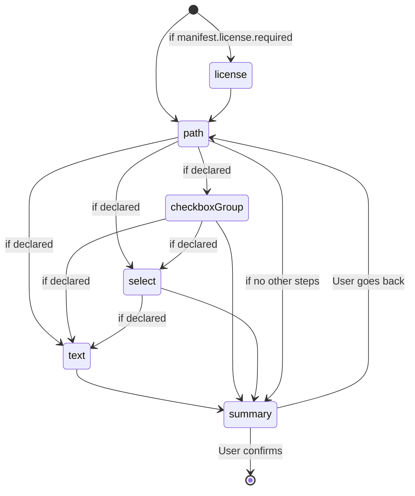

The order of `wizard` array entries is the visual order; `summary` must be last.

### 3.4. Template variables

Wizard answers are referenceable in `install.extract[*].to`, `install.extract[*].when`, all `postInstall` action fields, and `uninstall` paths via `{{stepId}}` or `{{stepId.subId}}`.

System variables:

| Variable | Resolves to |
|---|---|
| `{ProgramFiles}` | `C:\Program Files` (machine scope) |
| `{ProgramFilesX86}` | `C:\Program Files (x86)` |
| `{LocalAppData}` | `C:\Users\<u>\AppData\Local` (user scope) |
| `{Desktop}` | Current user's desktop |
| `{StartMenu}` | Current user's start menu Programs folder |
| `{Temp}` | `%TEMP%` |
| `{InstallerVersion}` | Host semver |
| `{AppId}` | `manifest.id` |
| `{AppVersion}` | `manifest.version` |

### 3.5. `when` condition language

A minimal expression grammar — no eval. Supported operators: `==`, `!=`, `&&`, `||`, `!`. Operands: template variables and string/boolean literals. Parsed by a hand-written tokenizer; rejects anything else.

Examples:
- `{{components.samples}}`
- `{{shortcut}} != 'none'`
- `{{components.vstPath}} && {{components.core}}`

### 3.6. PostInstall actions (closed set)

| Type | Purpose | Constraints |
|---|---|---|
| `shortcut` | Create a `.lnk`. | `where ∈ {desktop, startMenu, programs}`; target must resolve inside `{{installPath}}`. |
| `registry` | Write registry values. | Hive ∈ {HKCU, HKLM}; HKLM requires elevated worker. Key prefix limited to `Software\Samsung\…` and standard ARP locations. |
| `envPath` | Add directory to PATH. | Scope ∈ {user, machine}; path must resolve inside `{{installPath}}`. |
| `exec` | Run a binary from payload. | Hash-pinned; no shell; static args; timeout enforced. |
| `arpRegister` (implicit) | Always run automatically — registers the app under Windows "Apps & features". Not user-declarable. |

Manifests cannot declare arbitrary post-install behavior beyond this set. This is by design — see §6.

### 3.7. Uninstall

The host records every change made during install in a per-app journal (§7.4). On uninstall, the journal is replayed in reverse. The manifest's `uninstall` block is mostly redundant for safety, but supports `preExec` (deregistration commands) and explicit overrides for paths/keys that the journal cannot capture (e.g., user-data directories the user wants deleted).

```mermaid
sequenceDiagram
    autonumber
    participant U as User
    participant Src as Trigger source
    participant H as Host
    participant FS as Filesystem / Registry

    alt From host UI
        U->>H: Click "Uninstall"
        H->>U: Confirm modal: "Keep my settings?"
    else From Windows "Apps & features"
        U->>Src: Click Uninstall
        Src->>H: Run host with --uninstall &lt;app-id&gt;
        H->>U: Confirm modal: "Keep my settings?"
    end
    H->>H: Begin transaction
    H->>FS: Run manifest.uninstall.preExec (if any)
    H->>FS: Replay journal inverse:<br/>remove env PATH entries
    H->>FS: Remove registry keys/values created
    H->>FS: Delete shortcuts created
    H->>FS: Delete files extracted
    alt User said: do not keep settings
        H->>FS: Delete user-data dir (manifest declared)
    end
    H->>FS: Remove ARP entry
    H->>FS: Commit transaction
    H->>FS: Update installed.json (remove app)
    H-->>U: "Uninstalled"
```

### 3.8. App identity, versions, channels

- `id` is reverse-DNS, immutable across versions. Two manifests with the same `id` describe the same app at different versions.
- `version` is semver (`MAJOR.MINOR.PATCH[-prerelease]`).
- An app's catalog entry lists which `channels` its releases are visible in.
- A pre-release version (`-beta.1`) is only visible to users who opt into that channel.

---

## 4. Catalog

### 4.1. catalog.json schema

```jsonc
{
  "schemaVersion": 1,
  "updatedAt": "2026-05-01T12:00:00Z",
  "channels": ["stable", "beta", "internal"],
  "categories": [
    { "id": "audio",  "label": { "ko": "오디오", "en": "Audio" } },
    { "id": "video",  "label": { "ko": "비디오", "en": "Video" } },
    { "id": "tools",  "label": { "ko": "도구",   "en": "Tools" } }
  ],
  "featured": ["com.samsung.vdx.exampleapp"],
  "apps": [
    {
      "id": "com.samsung.vdx.exampleapp",
      "repo": "samsung/example-app",
      "category": "audio",
      "channels": ["stable", "beta"],
      "tags": ["vst3", "plugin"],
      "minHostVersion": "1.0.0",
      "deprecated": false,
      "replacedBy": null,
      "addedAt": "2026-04-15T00:00:00Z"
    }
  ]
}
```

Served from `samsung/vdx-catalog` repo. The file is pulled raw via `https://raw.githubusercontent.com/samsung/vdx-catalog/main/catalog.json`.

### 4.2. Catalog signature

`catalog.json.sig` (Ed25519, detached) sits next to it. The host verifies on every fetch. Signature failure → use last known good cache + show "Catalog signature failed, using cached version" warning. Two consecutive failures → block new installs but let installed apps update from already-trusted manifests.

### 4.3. Catalog refresh policy

- On host startup
- Every 6 hours while running
- On user "Refresh" click
- On network reconnect after offline

ETag / `If-Modified-Since` honored. Failure to refresh is non-fatal; cached catalog is used until next success.

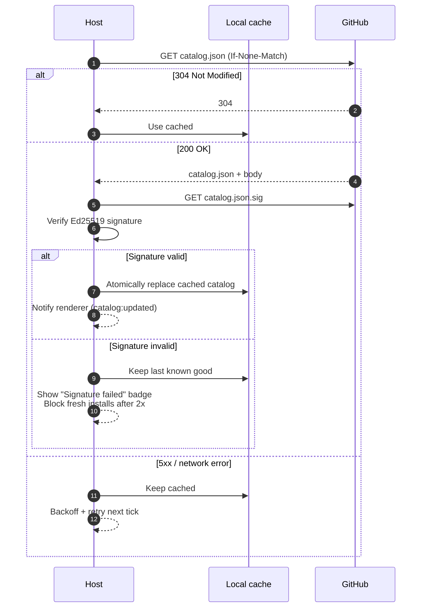

### 4.4. Catalog UI

- **Sidebar**: All apps · Featured · Categories · Installed · Updates available · Recently added
- **Search**: Fuzzy over name/tags/description (Korean + English)
- **Sort**: Name · Recently updated · Size · Recently added
- **Filter**: Channel selector (visible per user permission), `installed`/`not installed`/`update available`
- **Cards**: Icon · Name · Publisher · Short description · Install/Update/Open button
- **Detail view**: Full description · screenshots · changelog (from GitHub Releases body) · version history · install size · system requirements · "Install" / "Update" / "Uninstall" buttons

---

## 5. Auto-update

### 5.0. Update flow at a glance

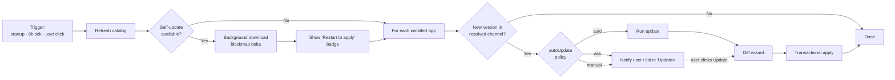

### 5.1. Host self-update

Mechanism: `electron-updater` with NSIS provider, fed from `samsung/vdx-installer` GitHub Releases (`latest.yml`).

- Check on startup + every 6 hours.
- Background download.
- Apply on next launch by default. User-facing "Restart now" button.
- Never force-restart — installs may be in flight.
- Delta updates via blockmap.
- Critical updates (host announces `minHostVersion` raised) → soft-block: install/update for affected apps grayed out with "Update VDX Installer first" CTA. The host itself is never silently auto-restarted.

### 5.2. App auto-update

- After every catalog refresh, compare each installed app's version with its latest manifest in the resolved channel.
- Per-app policy: `auto` | `ask` | `manual` (user-configurable, default `ask`).
- Updates run through the same trust + transactional pipeline as fresh installs (§6, §7).

### 5.3. Wizard answer reuse on update

When a manifest's wizard is identical or compatibly extended:

1. For each step in the new manifest's `wizard`:
   - If a step with the same `id` and `type` exists in the previous install's saved answers → reuse the answer silently.
   - If the step is new or its `type` changed → prompt the user only for that step.
2. If only the `summary` step would remain after reuse → skip the wizard entirely and go straight to "Updating…" progress.

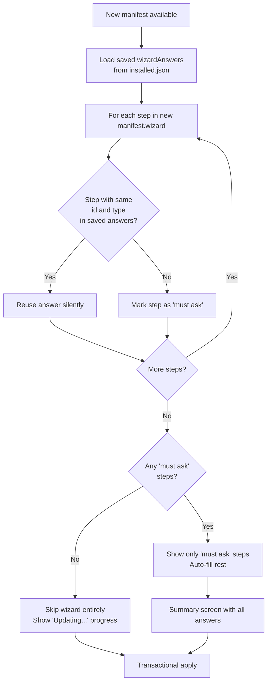

### 5.4.0. Apply strategy diagram

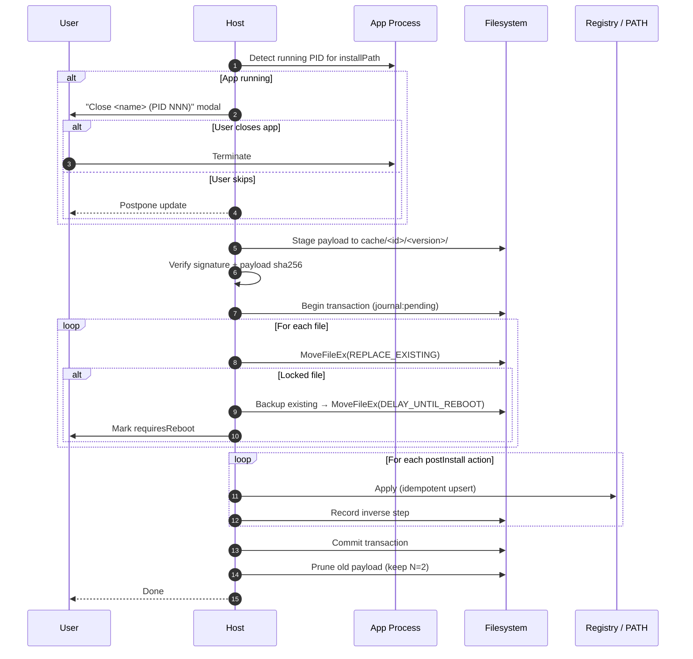

### 5.4. Apply strategy

1. Check app process is not running. If running, prompt user to close (display PID + exe name) or skip.
2. Stage payload to `%APPDATA%/vdx/cache/<app-id>/<version>/`.
3. Verify signature + payload hash.
4. Begin transaction (§7.4).
5. Move new files into place; on locked files use `MoveFileEx(MOVEFILE_DELAY_UNTIL_REBOOT)` as fallback (only with explicit user consent — sets `requiresReboot`).
6. Re-run postInstall actions (idempotent: shortcut/registry/envPath are upserts).
7. On failure: rollback via journal.
8. On success: update `installed.json`, prune old payload from cache (keep N=2 previous versions for fast rollback).

### 5.5. Rollback / older versions

The catalog detail view shows version history. User can install an older version via "Install specific version…" — protected by a confirmation modal warning of known regressions risk. Older payload retrieved from GitHub Releases on demand; cache reused if present.

### 5.6. Cache & offline

- Downloaded packages live in `%APPDATA%/vdx/cache/`, default LRU cap 5GB (configurable).
- Catalog last successful fetch is cached → offline launches still display the catalog (with stale indicator).
- A previously-downloaded package can be reinstalled offline.

---

## 6. Security & Integrity

### 6.1. Trust chain

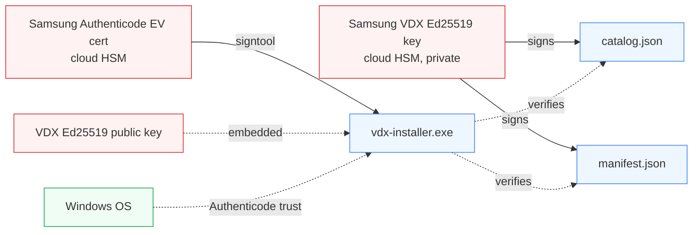

Key storage:
- **Authenticode private key**: cloud HSM (Azure Key Vault / Google KMS).
- **VDX Ed25519 private key**: same HSM. Signing happens in CI via a privileged GitHub Actions workflow with OIDC-bound HSM access. The key never touches a developer laptop.
- **VDX Ed25519 public key**: hardcoded into the host binary. Rotation requires a host release.

### 6.2. Verification rules

| Artifact | Verified against | On failure |
|---|---|---|
| Host EXE | Windows Authenticode (OS-level) | OS blocks; SmartScreen warns. |
| `catalog.json` | `catalog.json.sig` + embedded VDX key | Use last known good cache, warn. Block fresh installs after 2 consecutive failures. |
| `manifest.json` | `manifest.json.sig` + embedded VDX key | Reject install. Allow only in developer mode. |
| `payload.zip` | `manifest.payload.sha256` | Discard cache, retry once, then fail. |
| `exec` action binary | `allowedHashes` in manifest | Skip action; mark install as failed; rollback. |
| Auto-updates (host) | electron-updater signature check + Authenticode | Reject update. |

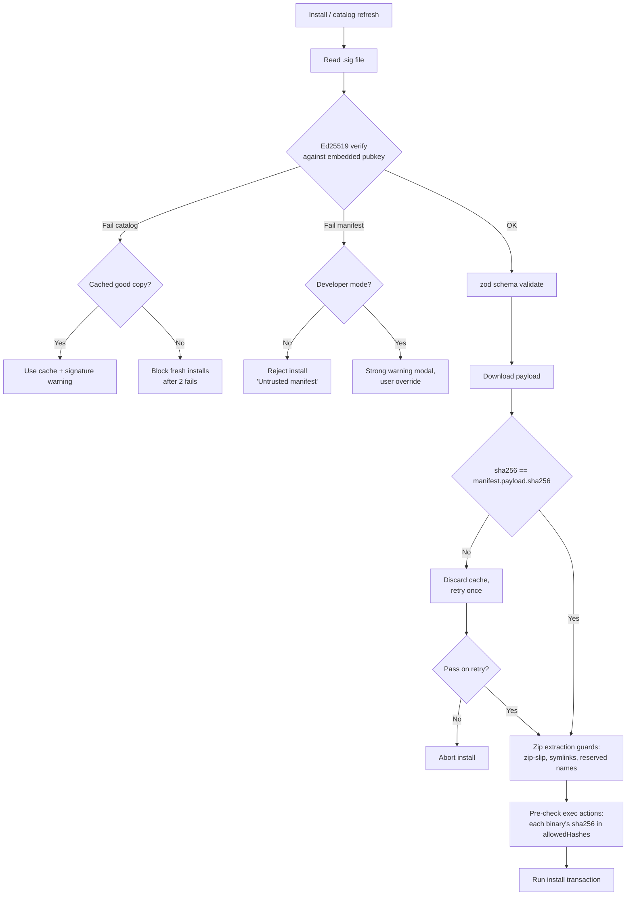

### 6.3. Exec action constraints

- `cmd` must resolve inside the just-extracted payload directory.
- `args` is a static array of strings; template variables allowed but no shell metacharacters expansion. Exec is `CreateProcess` with explicit argv — no `cmd.exe` interpretation.
- `timeoutSec` is enforced; default 30s, max 300s.
- stdout/stderr captured to log (truncated to 64KB each).
- Exit code 0 required for success.
- Each binary's sha256 must appear in `allowedHashes`. If absent, action is rejected by the validator before install begins.

### 6.4. Zip safety

- Reject entries with absolute paths.
- Reject `..` segments after normalization (zip slip).
- Reject symlinks, device nodes, hard links.
- Reject filenames with reserved Windows names (CON, PRN, NUL, etc.) or trailing whitespace/dots.
- Reject paths longer than the OS limit unless long-paths is enabled and user opted in.

### 6.5. Network safety

- All endpoints HTTPS.
- TLS verification mandatory; system trust store used (corporate CAs supported transparently).
- No certificate pinning (operationally fragile with GitHub).
- Proxy honored from system + user override.

### 6.6. Renderer hardening

- `contextIsolation: true`, `nodeIntegration: false`, `sandbox: true`.
- Strict CSP: no `unsafe-inline`, no remote scripts. All assets local except images explicitly fetched via main.
- Renderer talks to main only via the typed IPC API (zod-validated on both sides).
- External URLs in manifest descriptions open in default browser via `shell.openExternal` after URL allowlist (https only).

### 6.7. Developer mode

A hidden toggle (Settings → Advanced → "Developer mode") that:
- Allows installing unsigned manifests / sideloaded packages from untrusted publishers (with strong warning modal each time).
- Exposes verbose logs.
- Disables the manifest signature requirement.
- Cannot be enabled by manifest content — only by user click.

---

## 7. Local State, Transactions, Recovery

### 7.1. Filesystem layout

```
%APPDATA%/vdx-installer/
├─ installed.json            ← canonical state, atomic-written
├─ installed.json.bak        ← previous successful write
├─ cache/
│   ├─ catalog/              ← catalog.json + sig snapshots
│   └─ <app-id>/<version>/   ← downloaded payloads
├─ logs/
│   └─ installer-YYYY-MM-DD.log
├─ locks/
│   └─ <app-id>.lock
└─ journal/
    └─ <transaction-id>.json ← in-flight transaction log
```

### 7.2. installed.json

```jsonc
{
  "schema": 1,
  "host": { "version": "1.5.0" },
  "lastCatalogSync": "2026-05-01T12:00:00Z",
  "settings": {
    "language": "ko",
    "updateChannel": "stable",
    "autoUpdateHost": "ask",
    "autoUpdateApps": "ask",
    "cacheLimitGb": 5,
    "proxy": null,
    "telemetry": false,
    "trayMode": false,
    "developerMode": false
  },
  "apps": {
    "com.samsung.vdx.exampleapp": {
      "version": "1.2.3",
      "installScope": "user",
      "installPath": "C:/Users/case/AppData/Local/Programs/Samsung/ExampleApp",
      "wizardAnswers": { "...": "..." },
      "journal": [
        { "type": "extract", "files": ["bin/app.exe", "..."] },
        { "type": "shortcut", "path": "C:/Users/case/Desktop/Example App.lnk" },
        { "type": "registry", "hive": "HKCU", "key": "Software\\Samsung\\ExampleApp", "createdValues": ["InstallPath", "DeviceName"] },
        { "type": "envPath", "scope": "user", "added": "C:/.../bin" }
      ],
      "manifestSnapshot": { "...": "full manifest at install time" },
      "installedAt": "2026-04-30T11:23:00Z",
      "updateChannel": "stable",
      "autoUpdate": "ask"
    }
  }
}
```

Writes: write to `installed.json.tmp`, fsync, rename over `installed.json`, retain previous as `.bak`.

### 7.3. Locking

- **Host single-instance**: named mutex `Global\\VdxInstaller` (or per-user `Local\\…`). Second launch focuses first window via Electron's `requestSingleInstanceLock`.
- **Per-app**: `locks/<app-id>.lock` flock-style. Held during install/update/uninstall. UI grays out conflicting actions.

### 7.4. Transactions & journal

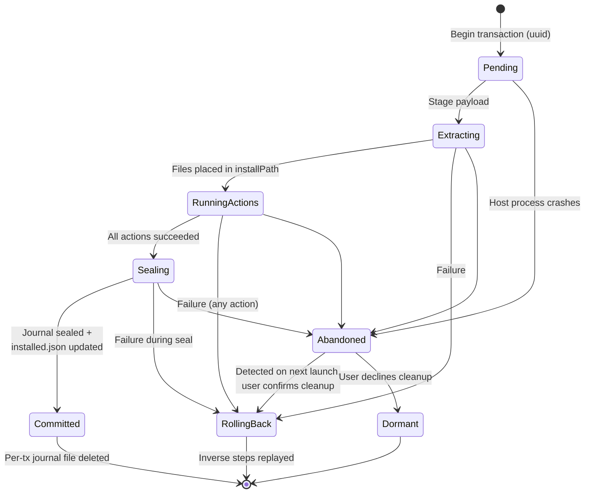

Each install/update/uninstall is wrapped:

1. Generate `transactionId` (uuid).
2. Write `journal/<txid>.json` with `{ appId, version, scope, status: "pending", steps: [] }`.
3. For each step performed (file extract batch, shortcut, registry write, envPath, exec), append a journal entry capturing the inverse — what to do to undo.
4. On success, mark journal `status: "committed"`, copy committed steps into `installed.json.apps[id].journal`, delete the per-tx journal file.
5. On failure or crash, on next host start, scan `journal/` for `pending`. Replay inverse steps. Notify user of cleanup.

Inverse operations:

| Forward | Inverse |
|---|---|
| Extract files | Delete extracted file paths |
| Move existing file aside (during overwrite) | Restore from backup |
| Create shortcut | Delete shortcut |
| Create registry key | Delete created key (only if empty post-cleanup) |
| Write registry value | Restore previous value (or delete if newly created) |
| Append to PATH | Remove entry |
| Exec | (no inverse — reason to constrain exec) |

`exec` actions are non-reversible by design. The journal records that one ran, but a manifest with exec actions should be designed so failure of subsequent steps does not require undoing the exec (e.g., put exec last; design the executable to be idempotent).

### 7.5. Crash recovery flow

On host start:
1. Read `journal/`.
2. For each pending tx, prompt user: "Previous install of {appName} v{version} did not finish. Roll back?"
3. On confirm, run inverse steps. Update `installed.json`.
4. If user declines, mark journal `status: "abandoned"` (visible in diagnostics, ignored thereafter).

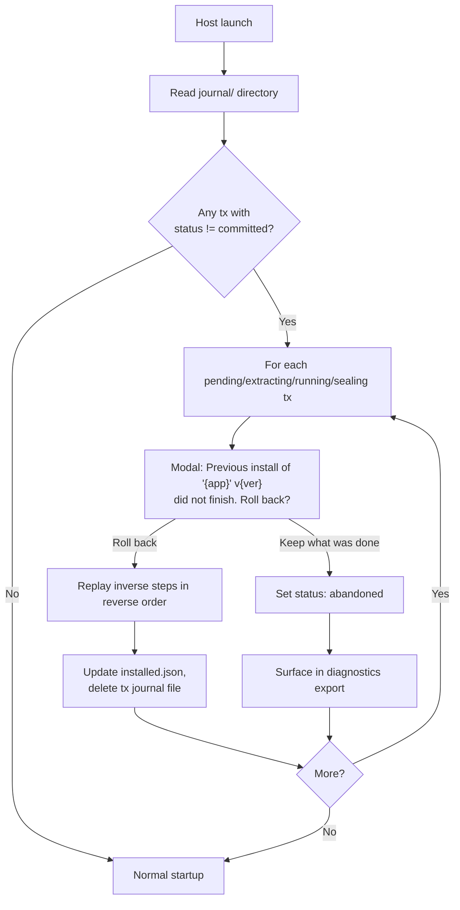

---

## 8. Permissions, Elevation, Install Scope

### 8.1. Scope semantics

| Scope | Path defaults | Registry hive | Shortcuts | UAC needed |
|---|---|---|---|---|
| `user` | `%LocalAppData%\Programs\Samsung\<App>` | HKCU | per-user start menu / desktop | no |
| `machine` | `C:\Program Files\Samsung\<App>` | HKLM | all-users start menu | yes |

### 8.2. Elevation model

- The installer runs as a **standard user** by default.
- For a `machine` install, the installer spawns `vdx-elevated-worker.exe` with a `runas` (UAC) prompt at the moment work is needed (not at host startup).
- The elevated worker accepts a single transaction-shaped command via stdio (signed by the parent process to prevent injection from unrelated processes), executes it, and exits.
- All HKLM writes, Program Files writes, machine-wide PATH edits, and ARP HKLM registration go through the worker.
- The worker uses the same engine code as the parent (shared library) — no logic divergence.

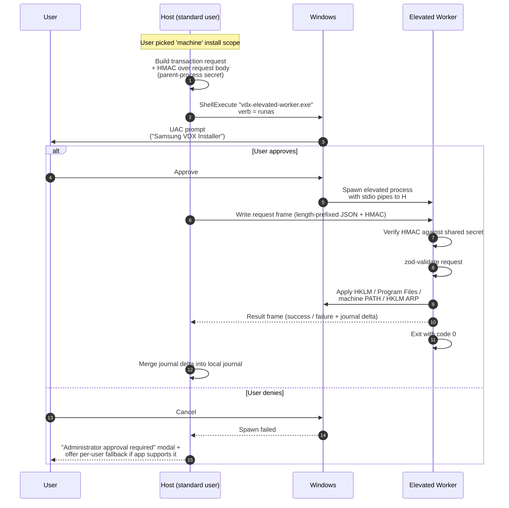

Why HMAC the request? Even with `runas`, an unrelated process running concurrently as Administrator on the same desktop could in principle attempt to drive the worker's stdio. The HMAC means the worker only accepts requests from a parent process that knows a secret derived per-launch. Defense in depth, not the primary control.

### 8.3. ARP integration

Every installed app is registered under either `HKCU\Software\Microsoft\Windows\CurrentVersion\Uninstall\<AppId>` or `HKLM\…\Uninstall\<AppId>` (depending on scope), with `DisplayName`, `Publisher`, `DisplayVersion`, `InstallLocation`, `EstimatedSize`, `UninstallString` pointing back to the host with arguments `--uninstall <app-id>`. This makes apps appear in Windows "Apps & features" and uninstallable through normal Windows UX.

---

## 9. Network & Authentication

### 9.1. HTTP client

- `undici` for all HTTP. Range requests for resumable downloads.
- Per-app concurrent download cap: 3 (configurable).
- Bandwidth limit: optional, configurable in settings.
- Retry policy: exponential backoff, max 5 attempts. 4xx is not retried (except 408, 429). 5xx + transport errors retry.
- Resume: partial files saved as `…<file>.partial`, joined when complete.

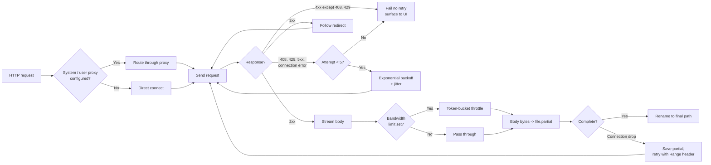

### 9.2. Proxy

- Auto-detect from system (`WinHTTP` settings).
- Manual override in settings (host:port + optional auth).
- Supports `http_proxy` / `https_proxy` env vars.
- Supports authenticating proxies (Basic; NTLM via `undici-proxy-agent` or fallback).
- All traffic — catalog, manifest, payload, self-update — routes through proxy.

### 9.3. GitHub auth (private repos)

- Settings UI accepts a fine-grained GitHub PAT with `Contents: read` on the relevant repos.
- Token stored in **Windows Credential Manager** via `keytar` (target `vdx-installer:github`).
- Token used as `Authorization: token <pat>` in GitHub API and Releases asset downloads.
- 401/403 → user-facing modal: "GitHub access denied. Update your token."
- Token rotation: setting page lets the user re-enter or remove.
- v2 (later): GitHub App / OAuth device flow.

---

## 10. Sideload

A `.vdxpkg` file is a zip containing `manifest.json`, `manifest.json.sig`, and `payload.zip`. Used for:

- Internal testing before publishing to GitHub
- Air-gapped distribution
- IT pre-staging

Behavior:

- Default file association: double-click `.vdxpkg` → opens the host with "Install this package?" dialog.
- Drag-and-drop into the host window: same flow.
- Signature must verify against trust root, otherwise the package is rejected unless **developer mode** is on.
- Sideloaded apps are tracked in `installed.json` like any other, but with `source: "sideload"` for diagnostics.

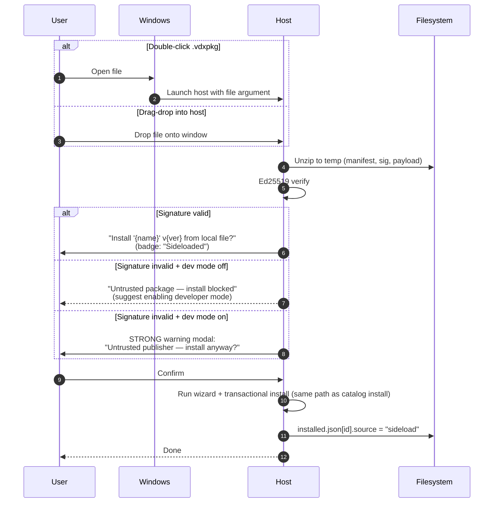

---

## 11. Logging, Diagnostics, Telemetry

### 11.1. Logging

- `electron-log` + custom redaction wrapper.
- Levels: trace · debug · info · warn · error.
- Log files: `%APPDATA%/vdx-installer/logs/installer-YYYY-MM-DD.log`. Rotated daily, 14 days retention.
- Each log line: `{timestamp, level, scope, txid?, appId?, msg, …}`.
- Redaction: PATs, registry value bodies on opt-in fields (e.g., `DeviceName`), absolute user-home paths replaced with `~/`. Redaction list is conservative — favor false positives.

### 11.2. Diagnostics export

Settings → "Export diagnostics" produces a ZIP:

- Last 7 days of logs (post-redaction)
- `installed.json` (post-redaction)
- System info: OS version + build, arch, free disk per drive, proxy config (sanitized), host version, network reachability summary
- Recent transaction journals (post-redaction)

The ZIP is saved to a user-chosen path — never auto-uploaded.

### 11.3. Crash reports

- Electron `crashReporter` writes minidumps to local crash folder.
- v1: local only, surfaced in diagnostics export.
- v2 (gated on org policy): optional upload to internal Sentry, opt-in only, with full payload preview.

### 11.4. Telemetry

- v1: **off by default**, no exfiltration. Settings toggle exists but disabled UI-wise until policy decides.
- If/when enabled: counters for {host start, catalog refresh success/fail, install attempt, install success, install failure cause, update success/fail}. No personal identifiers, no app-internal data, no install paths.

---

## 12. Internationalization

- Languages at v1: **Korean (ko), English (en)**.
- Default selection: `app.getLocale()` → match prefix; fallback to `en`.
- Manual override in settings.
- Renderer translation files in `src/renderer/i18n/{ko,en}.json`. Use `i18next` (lightweight, well-known).
- Manifest-level locales: every label/description/option label uses the form `{ "ko": …, "en": …, "default": … }`. The host resolves `currentLang → default`.
- Every user-facing string in the host UI is translation-keyed; no hardcoded text. Lint rule enforces this.

---

## 13. Settings, First-run, Tray

### 13.0. UI navigation map

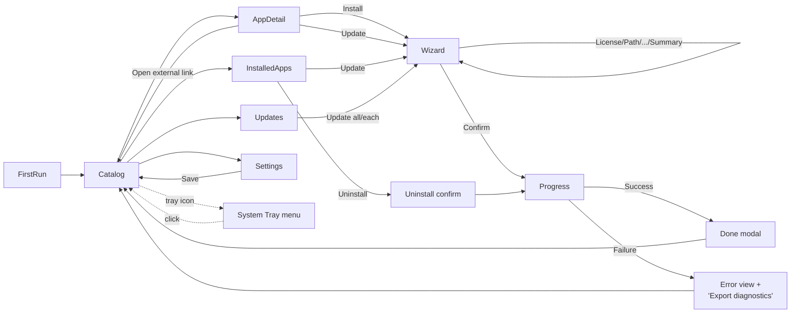


### 13.1. Settings UI

| Section | Items |
|---|---|
| General | Language · default install scope/path · run on system start |
| Updates | Host policy (auto/ask/manual) · App default policy · Channel (stable/beta/internal — gated by permission) |
| Network | Proxy auto/manual · download concurrency · bandwidth limit · GitHub token |
| Storage | Cache directory · cache size limit · "Clear cache" button |
| Privacy | Telemetry toggle (gated) · crash report upload (gated) |
| Advanced | Developer mode · log level · "Open log folder" · "Export diagnostics" |
| About | Host version · public key fingerprint · open-source licenses |

### 13.2. First-run

1. Language picker (auto-detected highlighted).
2. Host EULA accept.
3. Optional: GitHub PAT entry (skippable).
4. Initial catalog sync with progress.
5. Tray-mode prompt ("Keep VDX Installer in the system tray?").
6. Land on catalog.

```mermaid
flowchart LR
    Start[First launch detected<br/>installed.json absent] --> Lang[Language picker]
    Lang --> Eula[Host EULA accept]
    Eula -->|Decline| Quit[Quit host]
    Eula -->|Accept| Token{Private repos?}
    Token -->|Yes, enter PAT| Save[Save in keytar]
    Token -->|Skip| Sync
    Save --> Sync[Initial catalog sync<br/>with progress]
    Sync --> SyncOk{Success?}
    SyncOk -->|No| Offline[Show 'Offline / proxy?' help<br/>continue with empty catalog]
    SyncOk -->|Yes| Tray[Ask: 'Keep in system tray?']
    Offline --> Tray
    Tray --> Catalog[Land on catalog page]
    Catalog --> Persist[Persist installed.json with settings]
```

### 13.3. System tray

- Icon in Windows tray when enabled.
- Closing the window minimizes to tray (configurable).
- Right-click menu: Open · Check for updates · Quit.
- Toast notifications for new app available, update available, install completed, install failed.
- Background polling continues with low CPU footprint.

---

## 14. Tech Stack (locked-in)

| Concern | Choice | Rationale |
|---|---|---|
| Runtime | Electron 33 LTS | OS APIs, Chromium rendering, Node bundled. |
| Language | TypeScript 5.x throughout | Type safety; manifest engine clarity. |
| UI framework | React 19 | Familiar; large ecosystem. |
| UI bundler | Vite | Fast dev loop. |
| UI styles | Tailwind CSS + small headless component set | Matches the design from `vdx-installer.html`; fast iteration. |
| Renderer state | Zustand | Light, no boilerplate. |
| IPC | Custom typed channels via zod schemas (lightweight, audited surface) | tRPC's HTTP semantics not needed; explicit channels match security model better. |
| Schema validation | zod | Shared between renderer + main + CLI. |
| HTTP | undici | Performance + range support. |
| Zip | yauzl + yazl (streaming) | Avoids loading whole zip in memory. |
| Signature | @noble/ed25519 | Audited, dependency-light. |
| Updater | electron-updater (NSIS provider) | Standard. |
| Keychain | keytar | Wraps Windows Credential Manager. |
| Logger | electron-log + redaction wrapper | Files + console; daily rotation. |
| Tests | vitest + Playwright (Electron) | Unit + E2E. |
| Packaging | electron-builder + NSIS | Standard for Windows. |
| Code signing | electron-builder + signtool, EV cert via cloud HSM | SmartScreen reputation. |
| Process model | main + renderer + preload + on-demand elevated worker | Least privilege. |

---

## 15. Project Structure

### 15.1. Repos

| Repo | Purpose |
|---|---|
| `samsung/vdx-installer` | The Electron app. This document covers it. |
| `samsung/vdx-pack` | Developer CLI + manifest schema (npm package). |
| `samsung/vdx-pack-action` | GitHub Action wrapping `vdx-pack`. |
| `samsung/vdx-app-template` | Template repo for app teams. |
| `samsung/vdx-catalog` | `catalog.json` + signed; PR-gated registration. |
| `samsung/vdx-docs` | Static docs site (GitHub Pages). |

### 15.2. vdx-installer directory tree

```
vdx-installer/
├─ src/
│  ├─ main/
│  │  ├─ index.ts                    Electron entrypoint
│  │  ├─ ipc/                        Typed IPC handlers + zod contracts
│  │  ├─ catalog/                    Sync, cache, signature verify
│  │  ├─ packages/                   Download, verify, extract
│  │  ├─ engine/
│  │  │  ├─ schema.ts                manifest.json zod schema
│  │  │  ├─ wizard.ts                Wizard evaluation, answer reuse
│  │  │  ├─ template.ts              {{var}} resolver + when expr parser
│  │  │  ├─ install.ts               extract orchestration
│  │  │  ├─ post-install/
│  │  │  │  ├─ shortcut.ts
│  │  │  │  ├─ registry.ts
│  │  │  │  ├─ envPath.ts
│  │  │  │  ├─ exec.ts
│  │  │  │  └─ arp.ts
│  │  │  ├─ uninstall.ts
│  │  │  └─ transaction.ts           Journal + rollback
│  │  ├─ state/                      installed.json read/write, atomic
│  │  ├─ updater/                    Self-update + per-app updater
│  │  ├─ auth/                       keytar wrapper
│  │  ├─ network/                    undici client, proxy, retry, resume
│  │  ├─ elevation/                  spawn elevated worker, signed IPC
│  │  ├─ logging/                    electron-log + redaction
│  │  ├─ tray/                       Tray icon + menu
│  │  └─ telemetry/                  Counters + opt-in dispatcher
│  ├─ preload/                       contextBridge surface
│  ├─ renderer/
│  │  ├─ pages/
│  │  │  ├─ Catalog.tsx
│  │  │  ├─ AppDetail.tsx
│  │  │  ├─ Wizard.tsx
│  │  │  ├─ InstalledApps.tsx
│  │  │  ├─ Updates.tsx
│  │  │  ├─ Settings.tsx
│  │  │  └─ FirstRun.tsx
│  │  ├─ components/
│  │  │  ├─ wizard-steps/{License,Path,CheckboxGroup,Select,Text,Summary}.tsx
│  │  │  ├─ ProgressView.tsx
│  │  │  ├─ ErrorView.tsx
│  │  │  └─ …
│  │  ├─ store/                      Zustand slices
│  │  ├─ i18n/                       ko.json, en.json, hooks
│  │  └─ styles/                     Tailwind + globals
│  ├─ elevated-worker/               Standalone exe entry, shared engine
│  └─ shared/                        zod schemas, types, constants
├─ resources/
│  ├─ icons/
│  ├─ keys/                          embedded VDX public key (.bin)
│  └─ EULA/                          host EULA (ko, en)
├─ build/                            electron-builder configs, NSIS scripts
├─ test/
│  ├─ unit/
│  ├─ engine/
│  └─ e2e/
├─ scripts/
│  ├─ make-fake-package.ts
│  └─ generate-keys.ts (dev only)
├─ electron-builder.yml
├─ vite.config.ts
├─ tsconfig.json
├─ package.json
└─ README.md
```

---

## 16. Developer Onboarding (App Teams)

### 16.0. End-to-end onboarding flow

```mermaid
flowchart TD
    Start[App team has a Windows app<br/>built as portable EXE / folder] --> Tmpl["Click 'Use this template'<br/>on samsung/vdx-app-template"]
    Tmpl --> Open[Open repo in Cursor / Cline / Codex]
    Open --> AI[AI assistant reads<br/>AGENTS.md, .cursor/rules/,<br/>.clinerules/]
    AI --> Edit[AI edits manifest.json]
    Edit --> Val[Run vdx-pack validate --json]
    Val --> Pass{Pass?}
    Pass -->|No| Edit
    Pass -->|Yes| Sim[Run vdx-pack test --simulate --json]
    Sim --> SimPass{Pass?}
    SimPass -->|No| Edit
    SimPass -->|Yes| Human[Human review of<br/>simulated wizard + actions]
    Human --> Tag[Bump version, tag vN.N.N, push]
    Tag --> CI[GitHub Actions:<br/>vdx-pack-action]
    CI --> Build[validate + build]
    Build --> Sign[Call vdx-signing-service workflow]
    Sign --> Rel[Create GitHub Release with<br/>manifest.json, .sig, payload.zip,<br/>icon, screenshots]
    Rel --> CatPR[PR to samsung/vdx-catalog<br/>add app entry]
    CatPR --> CatCI[Catalog CI: schema, sig, id-uniqueness,<br/>vdx-pack validate against latest release]
    CatCI --> Review[Human reviewer approves]
    Review --> Merge[Merge → catalog re-signed in CI]
    Merge --> Live[Users see app on next refresh]

    classDef ai fill:#fef3c7,stroke:#f59e0b;
    classDef ci fill:#dbeafe,stroke:#3b82f6;
    classDef human fill:#dcfce7,stroke:#16a34a;
    class AI,Edit,Val,Sim ai
    class CI,Build,Sign,Rel,CatCI,Merge ci
    class Human,Review human
```

### 16.1. `vdx-app-template` repo

```
my-app/
├─ manifest.json                   ← edit me
├─ payload/                        ← drop your build output here
├─ AGENTS.md                       ← AI assistant general rules
├─ .cursor/rules/vdx-packaging.mdc ← Cursor always-on rule
├─ .clinerules/vdx-packaging.md    ← Cline rule
├─ .vscode/settings.json           ← JSON schema binding for autocompletion
├─ .github/workflows/release.yml   ← reusable release workflow
├─ scripts/build-payload.example.ps1
└─ README.md
```

### 16.2. `vdx-pack` CLI

| Command | Description |
|---|---|
| `vdx-pack init` | Interactive scaffold (mostly redundant with template — kept for convenience). |
| `vdx-pack validate [--json]` | Validate `manifest.json`: schema, template variable resolvability, exec hash availability, payload references. |
| `vdx-pack hash <path>` | Print sha256 of a binary; convenience for `allowedHashes`. |
| `vdx-pack build` | Produce `dist/release/` (individual files for GitHub Release upload) **and** `dist/<id>-<version>.vdxpkg` (sideload zip of the same files). Computes `payload.sha256`, `size.download`, `size.installed`. |
| `vdx-pack sign --key <path or env>` | Produce `manifest.json.sig` from local key (dev) or via signing service. |
| `vdx-pack test --simulate [--json]` | Dry-run wizard + install + post-install with answers from a fixture; writes nothing. |
| `vdx-pack test --sandbox` | Run real install in Windows Sandbox (when available). |
| `vdx-pack publish [--draft]` | Create GitHub release with `manifest.json`, `manifest.json.sig`, `payload.zip`, icon, screenshots. |
| `vdx-pack lint` | Style/conventions check (id naming, Korean+English copy presence, etc.). |

All commands support `--json` for AI consumption. Exit codes: 0 success · 1 user error · 2 validation failure · 3 system/network error.

```mermaid
sequenceDiagram
    autonumber
    participant Dev as Developer
    participant AI as AI Assistant<br/>(Cursor / Cline)
    participant CLI as vdx-pack
    participant FS as Filesystem

    Dev->>AI: "Add this app to vdx-installer"
    AI->>FS: Read manifest.json, payload/, AGENTS.md
    AI->>AI: Reason about wizard / actions
    AI->>FS: Edit manifest.json
    AI->>CLI: vdx-pack validate --json
    CLI-->>AI: { ok: false, errors: [...] }
    AI->>FS: Fix errors
    AI->>CLI: vdx-pack validate --json
    CLI-->>AI: { ok: true }
    AI->>CLI: vdx-pack test --simulate --json
    CLI-->>AI: { wizardFlow, actions, finalState }
    AI->>Dev: Summarize wizard + actions in plain language<br/>"Ready. Should I tag and release?"
    Dev->>AI: "Yes"
    AI->>CLI: vdx-pack build
    CLI-->>AI: dist/<id>-<ver>.vdxpkg + dist/release/
    AI->>Dev: ASK before tagging — do not autonomously push
    Dev->>FS: git tag vN.N.N + push (manual)
```

### 16.3. AI Rules

`AGENTS.md` (universal), `.cursor/rules/vdx-packaging.mdc`, `.clinerules/vdx-packaging.md` all carry the same semantic content. Key directives:

- The required validate-edit loop: edit manifest → run `vdx-pack validate --json` → fix errors → repeat.
- Hard rules: no secrets in manifest, no paths outside `{{installPath}}`, exec must include `allowedHashes`, `id` is immutable, semver bumps required.
- Linked schema: `https://vdx.samsung.com/schema/manifest-v1.json`.
- Prompt-handling rules: when developer says "test", run `vdx-pack test --simulate`; when developer says "release", run validate → build → simulate → ask for confirmation before tagging. Never push tags autonomously.

### 16.4. Catalog registration

A PR to `samsung/vdx-catalog` adds the app's repo entry to `apps[]`. The repo's CI:

1. Fetches the latest release of the new repo.
2. Verifies manifest schema, signature, `id` uniqueness.
3. Runs `vdx-pack validate` against the manifest.

A human reviewer approves and merges. Catalog is re-signed in CI (key in HSM). Users see the new app on next refresh.

---

## 17. Testing Strategy

```mermaid
graph TB
    E2E["E2E (Playwright + Electron)<br/>~20 scenarios on real Windows<br/>SLOW · expensive · highest fidelity"]
    Eng["Engine integration (vitest + memfs + mock APIs)<br/>~100+ cases · install/update/uninstall paths"]
    Unit["Unit (vitest)<br/>~500+ cases · zod, parser, journal, atomic write"]

    E2E --> Eng
    Eng --> Unit

    style E2E fill:#fee2e2,stroke:#ef4444;
    style Eng fill:#fef3c7,stroke:#f59e0b;
    style Unit fill:#dcfce7,stroke:#16a34a;
```

### 17.1. Unit (vitest, Linux/macOS/Windows runners)

- zod schemas: edge cases (extra/missing fields, wrong types).
- Template engine: variable resolution, `when` parser (rejects malformed expressions, evaluates correctly).
- Wizard answer reuse algorithm.
- Journal forward/inverse correctness.
- Atomic state file writer.

### 17.2. Engine integration (vitest + memfs + mock Windows APIs)

- Run install/update/uninstall against an in-memory FS and a mock registry/PATH/shortcut layer.
- Verify journal correctness, rollback after each kind of failure.
- Verify postInstall actions in isolation and combination.

### 17.3. E2E (Playwright + Electron, Windows runner)

- Headed Electron driven by Playwright.
- Local fake GitHub server (express) serving fixture catalog + manifest + payload.
- Scenarios:
  - First-run flow.
  - Install fresh app (user scope) — wizard end-to-end.
  - Install machine-scope app (UAC mocked / skipped on CI; real on local).
  - Update with identical wizard (silent).
  - Update with extended wizard (only new step shown).
  - Network drop mid-download → resume.
  - Manifest signature failure → install rejected.
  - Payload hash mismatch → cache discarded, retry, then fail.
  - exec action with wrong hash → install rolled back.
  - Crash mid-install (kill process) → restart → cleanup prompt → rollback.
  - Sideload .vdxpkg via drag-drop.
  - Proxy via local proxy fixture.
  - Catalog refresh failure → cached catalog used.
  - Uninstall through host UI.
  - Uninstall through Windows "Apps & features" (calls our ARP UninstallString).

### 17.4. CI matrix

| Trigger | Runs | Runner |
|---|---|---|
| PR | lint, typecheck, unit, engine integration | ubuntu-latest |
| PR | smoke E2E (5 critical scenarios) | windows-latest |
| Push to main | full E2E + build artifacts | windows-latest |
| Tag push | full E2E + sign + create GitHub Release | windows-latest |

### 17.5. Manual verification checklist (per release)

Documented in `RELEASE.md`. Hits the things hard to automate fully (real UAC prompts, real corporate proxy, real Windows Sandbox install).

---

## 18. Build & Release Pipeline

```mermaid
flowchart LR
    Tag["git tag vN.N.N + push<br/>(samsung/vdx-installer)"] --> Lint[typecheck + lint]
    Lint --> Test[unit + engine tests]
    Test --> E2E[E2E suite<br/>windows-latest]
    E2E --> Build["electron-builder<br/>--win nsis"]
    Build --> Sign[Authenticode sign EV cert<br/>via cloud HSM signing service]
    Sign --> Block[Generate blockmap delta]
    Block --> Rel[Create GitHub Release]
    Rel --> Up[Upload assets:<br/>Setup.exe · blockmap · latest.yml]
    Up --> Notify[Optional: notify catalog repo]

    classDef gate fill:#fef3c7,stroke:#f59e0b;
    classDef build fill:#dbeafe,stroke:#3b82f6;
    classDef sign fill:#fee2e2,stroke:#ef4444;
    classDef rel fill:#dcfce7,stroke:#16a34a;
    class Lint,Test,E2E gate
    class Build build
    class Sign,Block sign
    class Rel,Up,Notify rel
```

### 18.1. Local development

- `pnpm dev` → Vite + Electron with HMR for renderer; main reload on save.
- Local key pair generated for dev signing (separate from production key).
- Local fake catalog/release server: `pnpm dev:fixture-server`.

### 18.2. CI release

On `vN.N.N` tag push to `samsung/vdx-installer`:

1. typecheck + lint + unit + engine integration tests.
2. E2E suite (windows-latest).
3. `electron-builder --win nsis`.
4. Sign output with EV cert via HSM-backed signing service (workflow uses OIDC-bound short-lived credentials).
5. Generate blockmap for delta updates.
6. Create GitHub Release with assets: `vdx-installer-Setup-N.N.N.exe`, `.exe.blockmap`, `latest.yml`.

### 18.3. Catalog/manifest signing service

A reusable GitHub Actions workflow (`samsung/vdx-signing-service`) — not a separate web service — that:

1. Accepts a file path as input via `workflow_call`.
2. Authenticates the calling repo via OIDC and an allowlist of permitted callers.
3. Reads the Ed25519 private key from a cloud HSM (Azure Key Vault / Google KMS) using short-lived credentials bound to the OIDC token.
4. Returns the detached signature as a workflow artifact.

Used by:

- App team release workflows via `vdx-pack-action` (which calls this signing workflow as a sub-step).
- `samsung/vdx-catalog` CI for re-signing `catalog.json` after each merge.

The Authenticode EV cert for the host EXE follows the same pattern but uses signtool with HSM-backed key access (azuresigntool / KSP plugin).

> **Naming note:** Hostnames like `vdx.samsung.com` and repo names like `samsung/vdx-installer` in this document are working placeholders. Final domain and GitHub org/repo names are to be confirmed before v1 release; references must be updated consistently in code, documentation, and signing trust policy.

---

## 19. Edge Cases & UX Guards

(Implementation must tick each of these.)

- [ ] Disk free < `payload.size.installed × 2` → block with friendly modal, suggest cache cleanup.
- [ ] Install path with non-ASCII / spaces / very long → manifest can declare a regex; default permissive.
- [ ] Path > 260 chars → require user opt-in for long-paths registry key, or refuse.
- [ ] App previously installed by external installer (ARP entry exists) → prompt user to take over or cancel.
- [ ] Target app process running during update → modal with "Close <name> (PID NNN)" or "Skip update".
- [ ] Network drop mid-download → silent resume with backoff; fail with retry CTA after exhaustion.
- [ ] Catalog stale (last sync > 12h) → status badge in header.
- [ ] System clock skewed → TLS or signature failure with explicit "Check your system time" hint.
- [ ] Antivirus quarantine of payload → caught error includes path + likely cause.
- [ ] User closes installer mid-install → graceful cancel: complete current atomic step, then rollback rest, then exit.
- [ ] Manifest missing `default` for any localized field → validator rejects.
- [ ] Payload contains symlink/device/hardlink → reject (§6.4).
- [ ] zip slip (`..` segments) → reject.
- [ ] HKLM write fails (UAC denied) → fall back to per-user (if app supports both) or fail with clear cause.
- [ ] keytar fails (e.g., Credential Manager broken) → degrade to in-process memory token, warn.
- [ ] Two simultaneous updates of same app initiated → second waits on lock or aborts.
- [ ] Two simultaneous updates of different apps → both proceed, capped by concurrency setting.
- [ ] Catalog defines an app with `minHostVersion` newer than current host → show "Update VDX Installer to install" CTA.
- [ ] Manifest references a payload file not present in zip → validator rejects at install time.
- [ ] `exec` binary missing or hash mismatch → install fails atomically.
- [ ] `requiresReboot` true → end-of-install screen prompts reboot, never auto-reboots.
- [ ] Existing user-data directory of an app being uninstalled → ask user "Keep my settings?" (default yes).
- [ ] Same app installed in both `user` and `machine` scope (legacy state) → detect and surface in installed-apps list as two distinct entries; uninstall each independently.

---

## 20. Documentation Deliverables

| Doc | Audience | Where |
|---|---|---|
| User guide | End users | `vdx-docs/user/` |
| App developer guide | App teams | `vdx-docs/dev/` + `vdx-app-template/README.md` |
| Manifest spec page (v1) | App teams | `vdx-docs/spec/manifest-v1` (also published as JSON Schema). |
| Operator guide | Internal IT | `vdx-docs/ops/` |
| Architecture reference | Installer engineers | `vdx-installer/docs/` (this file + supplements) |
| API/IPC reference | Installer engineers | Generated from zod schemas |
| Migration notes | All | `vdx-docs/migrations/` (from schema v1→v2 etc.) |

---

## 21. Migration & Versioning Policy

- Host minor versions must read older `installed.json` schemas. Migration steps run on first launch after upgrade and are themselves transactional (with `installed.json.bak`).
- Manifest `schemaVersion` v2 (future) — host must keep reading v1 manifests for at least one major version.
- Catalog `schemaVersion` similarly.
- ID format and ARP registration are intentionally compatible with Windows tooling: never break the ARP `UninstallString` of an installed app via host upgrades.

```mermaid
stateDiagram-v2
    [*] --> Fresh: First launch (installed.json absent)
    Fresh --> Configured: First-run flow completes
    Configured --> Active: Catalog synced
    Active --> Active: Catalog refresh / installs / updates
    Active --> SelfUpdating: New host version downloaded
    SelfUpdating --> Migrating: User restarts host
    Migrating --> Active: installed.json migrated<br/>journal replayed
    Active --> Crashed: Host process dies mid-tx
    Crashed --> Recovering: Next launch detects pending tx
    Recovering --> Active: Cleanup confirmed
    Active --> Uninstalling: User uninstalls host itself
    Uninstalling --> [*]
```

### 21.1. installed.json migration matrix

| From schema | To schema | Migration steps | Run when |
|---|---|---|---|
| (none) | 1 | Create from defaults | First-run |
| 1 | 2 (future) | Field renames + add defaults | First launch after host upgrade |
| 1 | 1 | No-op | Same major host version |

Migrations are wrapped in the same transactional/journal pattern as installs: write `installed.json.tmp`, fsync, rename. Old file kept as `installed.json.bak` until the next successful migration.

---

## 22. Open Questions / Future Work

Not blockers for v1, but tracked here:

1. **Signing key delegation**: Should app teams sign their own manifests with team-specific keys delegated by the root key? v1 says "no — single root key, signing service". Reconsider when team count grows.
2. **Cross-app dependencies**: A way to declare "App B requires App A v≥2". Currently out of scope.
3. **Install hooks for IT**: Pre-install / post-install policy hooks (e.g., logging to corporate inventory). Could be tray-mode plugin.
4. **GitHub App / OAuth device flow** for private repo access — a smoother UX than PATs.
5. **macOS / Linux**: Architecture deliberately keeps Windows specifics (registry, ARP, NSIS) localized in `post-install/` and `elevation/` to allow future ports, but no commitment.
6. **MSI/SCCM packaging of the host** for IT mass-deployment.
7. **App-side telemetry forwarding**: Letting apps emit install-time telemetry through the host to a central pipeline.
8. **Catalog auto-discovery**: Replace PR-gated registration with auto-scan of an org's repos that have `vdx-pack` releases (with policy gates).
9. **Internal Sentry/crash upload** — depends on org policy approval.

---

## 23. Acceptance Criteria for v1

The host is considered ready for v1 release when:

- All scenarios listed in §17.3 pass on Windows 10 22H2 and Windows 11 23H2.
- Authenticode signing pipeline works end-to-end and SmartScreen accepts the signed binary.
- A reference app (`samsung/vdx-example-app`) is fully published via the `vdx-pack` CLI and successfully installs/updates/uninstalls through the host.
- Install/update/uninstall of the reference app survives kill -9 of the host at any of: download, extract, post-install action, registry write, journal commit — with correct rollback.
- A private app (PAT-gated) installs successfully with token stored in Credential Manager.
- A sideloaded `.vdxpkg` installs successfully and the host correctly tracks it in `installed.json`.
- Korean and English UIs render correctly across all screens.
- Telemetry is off; no network calls beyond catalog/manifest/payload/self-update.
- Diagnostics export includes the items in §11.2 with sensitive data redacted.
- All edge cases in §19 are checked off.
