# VDX Installer — Detailed Flow Diagrams

**Companion to:** `2026-05-01-vdx-installer-design.md`
**Scope:** Sequence/flow/state diagrams for every named scenario in the design spec, especially the E2E test scenarios in §17.3 of the main spec.
**Reading order:** Read after the main spec. This file does not introduce new design decisions — it visualizes the flows the main spec describes textually.

Each section is self-contained: the diagram, a short prose summary, and a pointer to the relevant main-spec section.

---

## 1. Fresh install (happy path)

> Main spec: §3.0, §3.2

```mermaid
sequenceDiagram
    autonumber
    participant U as User
    participant R as Renderer
    participant M as Main
    participant Net as Network (undici)
    participant GH as GitHub
    participant FS as FS / Registry / PATH
    participant State as installed.json

    U->>R: Click "Install" on app card
    R->>M: ipc.install:prepare(appId, channel)
    M->>Net: GET manifest.json + .sig
    Net->>GH: HTTPS
    GH-->>Net: 200
    Net-->>M: bytes
    M->>M: Verify Ed25519 sig (embedded pubkey)
    M->>M: zod-validate manifest
    M-->>R: manifest
    loop Wizard steps
        R->>U: Render step
        U->>R: Submit answer
        R->>R: regex / type validation
    end
    U->>R: Confirm summary
    R->>M: ipc.install:run(answers)
    M->>State: write 'pending' marker
    M->>Net: GET payload.zip (Range support)
    Net-->>M: stream bytes -> cache/.../payload.zip.partial
    M->>M: rename to payload.zip; verify sha256
    M->>FS: Begin tx (journal/<txid>.json = pending)
    M->>FS: Extract to temp dir
    M->>FS: Move into installPath
    M->>FS: Apply postInstall actions (record inverse in journal)
    M->>FS: Register ARP
    M->>FS: Mark journal committed; delete tx file
    M->>State: Atomic write installed.json (with .bak)
    M-->>R: progress events throughout
    M-->>R: install:complete
    R-->>U: "Installed" state
```

---

## 2. Update with identical wizard (silent fast-path)

> Main spec: §5.3

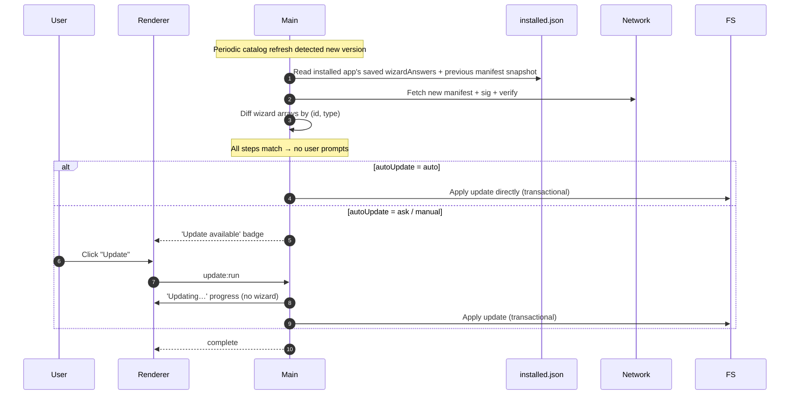
```mermaid
sequenceDiagram
    autonumber
    participant U as User
    participant R as Renderer
    participant M as Main
    participant State as installed.json
    participant Net as Network
    participant FS as FS

    Note over M: Periodic catalog refresh detected new version
    M->>State: Read installed app's saved wizardAnswers + previous manifest snapshot
    M->>Net: Fetch new manifest + sig + verify
    M->>M: Diff wizard arrays by (id, type)
    Note over M: All steps match → no user prompts
    alt autoUpdate = auto
        M->>FS: Apply update directly (transactional)
    else autoUpdate = ask / manual
        M-->>R: 'Update available' badge
        U->>R: Click "Update"
        R->>M: update:run
        M->>R: 'Updating…' progress (no wizard)
        M->>FS: Apply update (transactional)
    end
    M-->>R: complete
```

---

## 3. Update with extended wizard (only new step asked)

> Main spec: §5.3

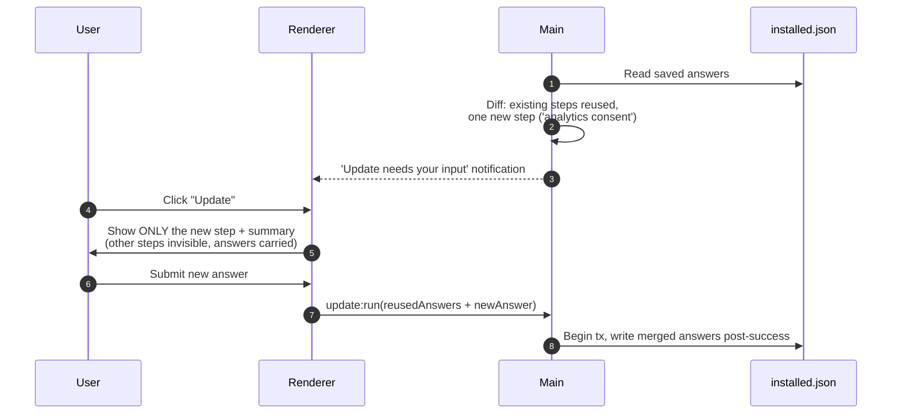
```mermaid
sequenceDiagram
    autonumber
    participant U as User
    participant R as Renderer
    participant M as Main
    participant State as installed.json

    M->>State: Read saved answers
    M->>M: Diff: existing steps reused,<br/>one new step ('analytics consent')
    M-->>R: 'Update needs your input' notification
    U->>R: Click "Update"
    R->>U: Show ONLY the new step + summary<br/>(other steps invisible, answers carried)
    U->>R: Submit new answer
    R->>M: update:run(reusedAnswers + newAnswer)
    M->>State: Begin tx, write merged answers post-success
```

---

## 4. Network drop mid-download → resume

> Main spec: §9.1

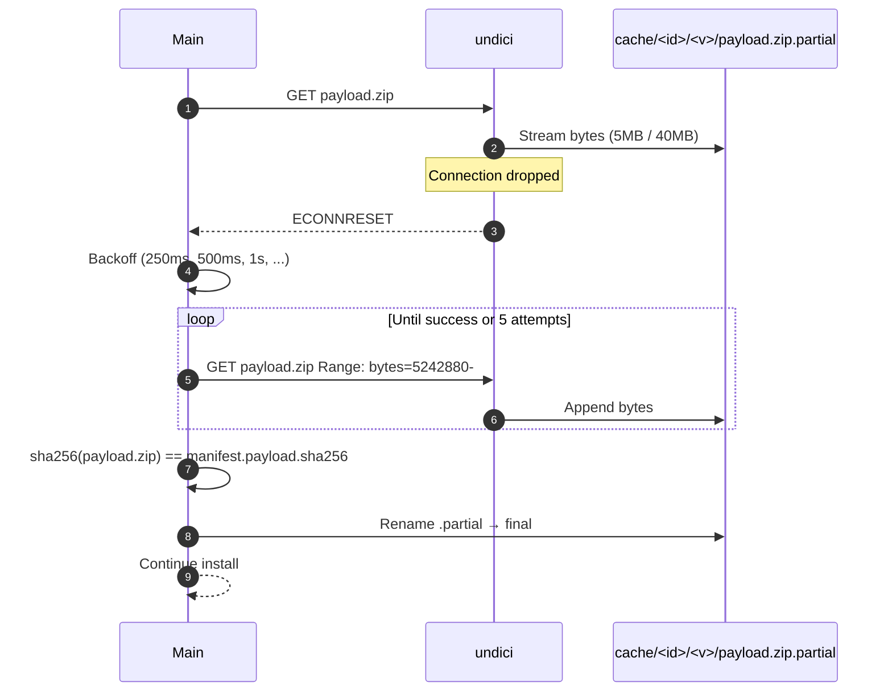
```mermaid
sequenceDiagram
    autonumber
    participant M as Main
    participant Net as undici
    participant FS as cache/<id>/<v>/payload.zip.partial

    M->>Net: GET payload.zip
    Net->>FS: Stream bytes (5MB / 40MB)
    Note over Net: Connection dropped
    Net-->>M: ECONNRESET
    M->>M: Backoff (250ms, 500ms, 1s, ...)
    loop Until success or 5 attempts
        M->>Net: GET payload.zip Range: bytes=5242880-
        Net->>FS: Append bytes
    end
    M->>M: sha256(payload.zip) == manifest.payload.sha256
    M->>FS: Rename .partial → final
    M-->>M: Continue install
```

---

## 5. Manifest signature failure

> Main spec: §6.2

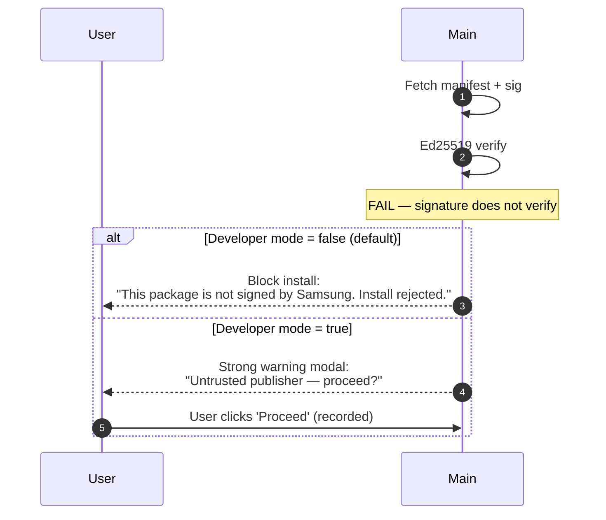
```mermaid
sequenceDiagram
    autonumber
    participant U as User
    participant M as Main

    M->>M: Fetch manifest + sig
    M->>M: Ed25519 verify
    Note over M: FAIL — signature does not verify
    alt Developer mode = false (default)
        M-->>U: Block install:<br/>"This package is not signed by Samsung. Install rejected."
    else Developer mode = true
        M-->>U: Strong warning modal:<br/>"Untrusted publisher — proceed?"
        U->>M: User clicks 'Proceed' (recorded)
    end
```

---

## 6. Payload hash mismatch

> Main spec: §6.2

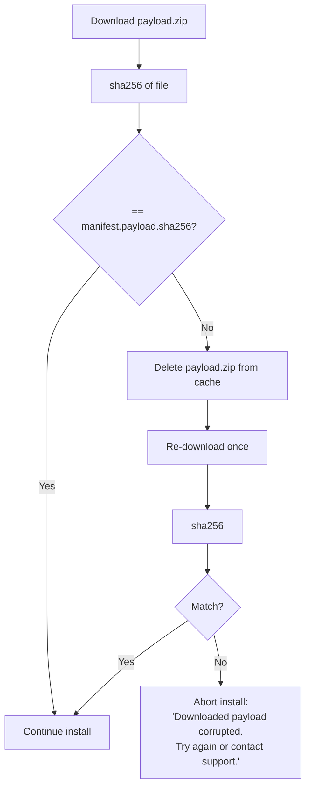
```mermaid
flowchart TD
    Start[Download payload.zip] --> Hash[sha256 of file]
    Hash --> Cmp{== manifest.payload.sha256?}
    Cmp -->|Yes| Continue[Continue install]
    Cmp -->|No| Discard[Delete payload.zip from cache]
    Discard --> Retry[Re-download once]
    Retry --> Hash2[sha256]
    Hash2 --> Cmp2{Match?}
    Cmp2 -->|Yes| Continue
    Cmp2 -->|No| Fail["Abort install:<br/>'Downloaded payload corrupted.<br/>Try again or contact support.'"]
```

---

## 7. exec action with wrong hash

> Main spec: §6.3

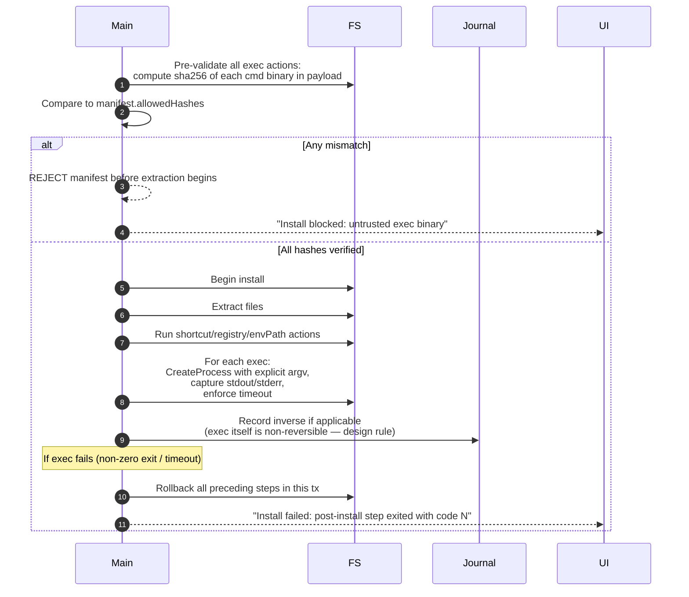
```mermaid
sequenceDiagram
    autonumber
    participant M as Main
    participant FS as FS
    participant Tx as Journal

    M->>FS: Pre-validate all exec actions:<br/>compute sha256 of each cmd binary in payload
    M->>M: Compare to manifest.allowedHashes
    alt Any mismatch
        M-->>M: REJECT manifest before extraction begins
        M-->>UI: "Install blocked: untrusted exec binary"
    else All hashes verified
        M->>FS: Begin install
        M->>FS: Extract files
        M->>FS: Run shortcut/registry/envPath actions
        M->>FS: For each exec:<br/>CreateProcess with explicit argv,<br/>capture stdout/stderr,<br/>enforce timeout
        M->>Tx: Record inverse if applicable<br/>(exec itself is non-reversible — design rule)
        Note over M: If exec fails (non-zero exit / timeout)
        M->>FS: Rollback all preceding steps in this tx
        M-->>UI: "Install failed: post-install step exited with code N"
    end
```

---

## 8. Crash mid-install → next-launch cleanup

> Main spec: §7.5

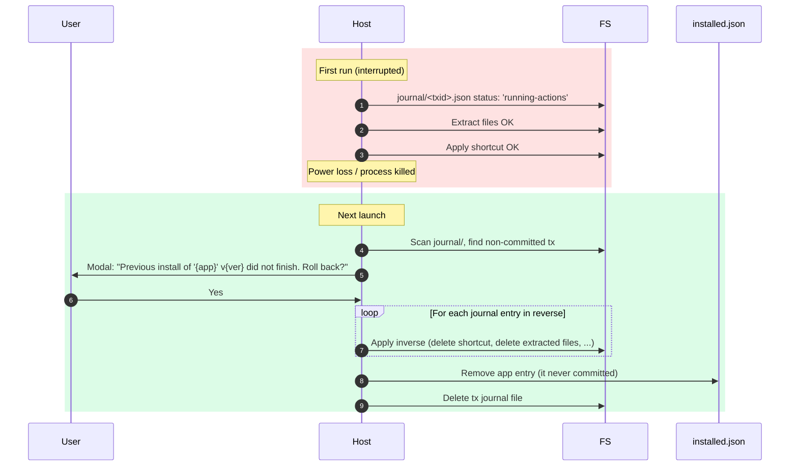
```mermaid
sequenceDiagram
    autonumber
    participant U as User
    participant H as Host
    participant FS as FS
    participant State as installed.json

    rect rgb(254, 226, 226)
        Note over H: First run (interrupted)
        H->>FS: journal/<txid>.json status: 'running-actions'
        H->>FS: Extract files OK
        H->>FS: Apply shortcut OK
        Note over H: Power loss / process killed
    end

    rect rgb(220, 252, 231)
        Note over H: Next launch
        H->>FS: Scan journal/, find non-committed tx
        H->>U: Modal: "Previous install of '{app}' v{ver} did not finish. Roll back?"
        U->>H: Yes
        loop For each journal entry in reverse
            H->>FS: Apply inverse (delete shortcut, delete extracted files, ...)
        end
        H->>State: Remove app entry (it never committed)
        H->>FS: Delete tx journal file
    end
```

---

## 9. Sideload .vdxpkg via drag-drop

> Main spec: §10

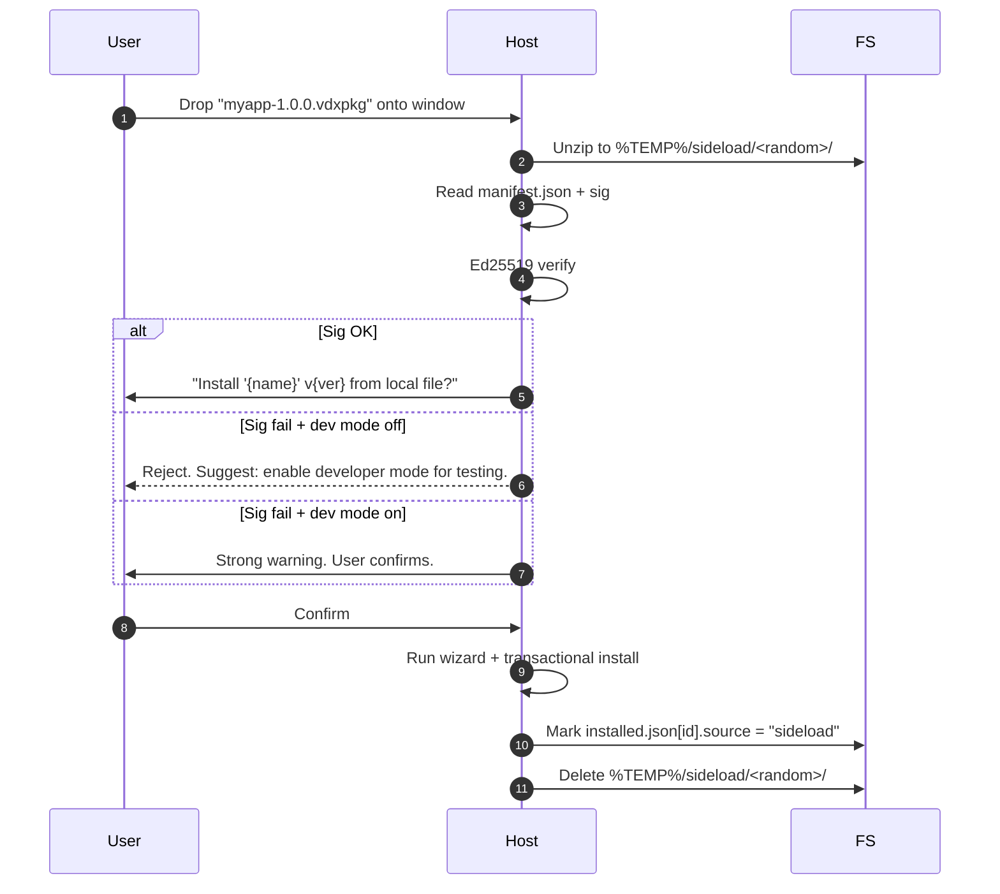
```mermaid
sequenceDiagram
    autonumber
    participant U as User
    participant H as Host
    participant FS as FS

    U->>H: Drop "myapp-1.0.0.vdxpkg" onto window
    H->>FS: Unzip to %TEMP%/sideload/<random>/
    H->>H: Read manifest.json + sig
    H->>H: Ed25519 verify
    alt Sig OK
        H->>U: "Install '{name}' v{ver} from local file?"
    else Sig fail + dev mode off
        H-->>U: Reject. Suggest: enable developer mode for testing.
    else Sig fail + dev mode on
        H->>U: Strong warning. User confirms.
    end
    U->>H: Confirm
    H->>H: Run wizard + transactional install
    H->>FS: Mark installed.json[id].source = "sideload"
    H->>FS: Delete %TEMP%/sideload/<random>/
```

---

## 10. Proxy + GitHub PAT (corporate network, private repo)

> Main spec: §9.2, §9.3

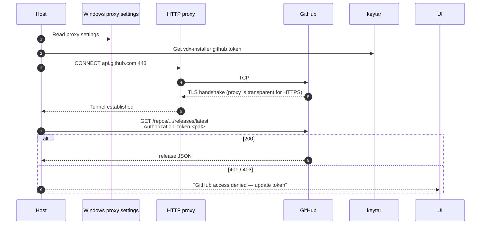
```mermaid
sequenceDiagram
    autonumber
    participant H as Host
    participant Sys as Windows proxy settings
    participant Proxy as HTTP proxy
    participant GH as GitHub
    participant KT as keytar

    H->>Sys: Read proxy settings
    H->>KT: Get vdx-installer:github token
    H->>Proxy: CONNECT api.github.com:443
    Proxy->>GH: TCP
    GH-->>Proxy: TLS handshake (proxy is transparent for HTTPS)
    Proxy-->>H: Tunnel established
    H->>GH: GET /repos/.../releases/latest<br/>Authorization: token <pat>
    alt 200
        GH-->>H: release JSON
    else 401 / 403
        H-->>UI: "GitHub access denied — update token"
    end
```

---

## 11. Catalog refresh failure → cached fallback

> Main spec: §4.3

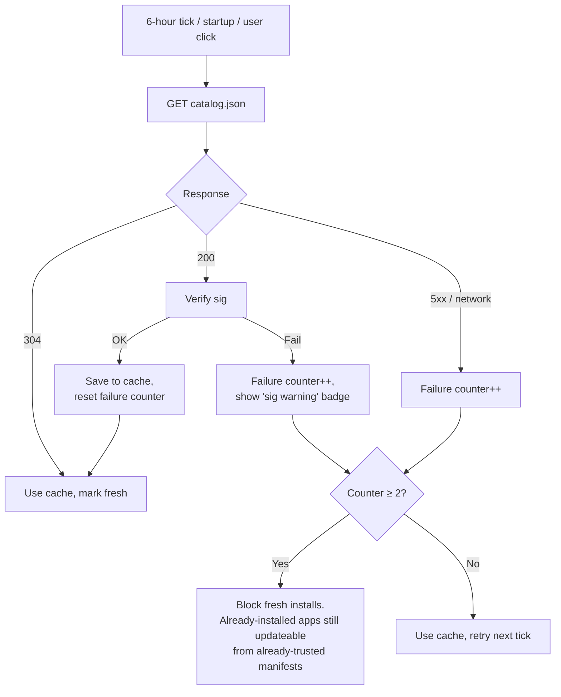
```mermaid
flowchart TD
    Tick[6-hour tick / startup / user click] --> Fetch[GET catalog.json]
    Fetch --> Resp{Response}
    Resp -->|200| Sig[Verify sig]
    Resp -->|304| Done[Use cache, mark fresh]
    Resp -->|5xx / network| Fail[Failure counter++]
    Sig -->|OK| Save[Save to cache,<br/>reset failure counter]
    Sig -->|Fail| BadSig[Failure counter++,<br/>show 'sig warning' badge]
    Save --> Done
    BadSig --> Block{Counter ≥ 2?}
    Fail --> Block
    Block -->|Yes| Hard[Block fresh installs.<br/>Already-installed apps still updateable<br/>from already-trusted manifests]
    Block -->|No| Soft[Use cache, retry next tick]
```

---

## 12. Uninstall through Windows "Apps & features"

> Main spec: §3.7, §8.3

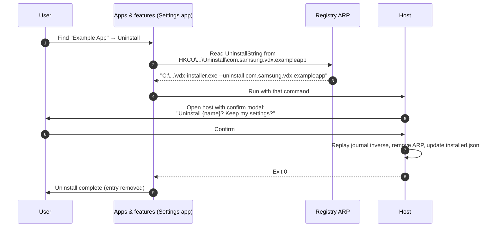
```mermaid
sequenceDiagram
    autonumber
    participant U as User
    participant CP as Apps & features (Settings app)
    participant Reg as Registry ARP
    participant H as Host

    U->>CP: Find "Example App" → Uninstall
    CP->>Reg: Read UninstallString from<br/>HKCU\...\Uninstall\com.samsung.vdx.exampleapp
    Reg-->>CP: "C:\...\vdx-installer.exe --uninstall com.samsung.vdx.exampleapp"
    CP->>H: Run with that command
    H->>U: Open host with confirm modal:<br/>"Uninstall {name}? Keep my settings?"
    U->>H: Confirm
    H->>H: Replay journal inverse, remove ARP, update installed.json
    H-->>CP: Exit 0
    CP->>U: Uninstall complete (entry removed)
```

---

## 13. Concurrent install/update of multiple apps

> Main spec: §7.3, §9.1

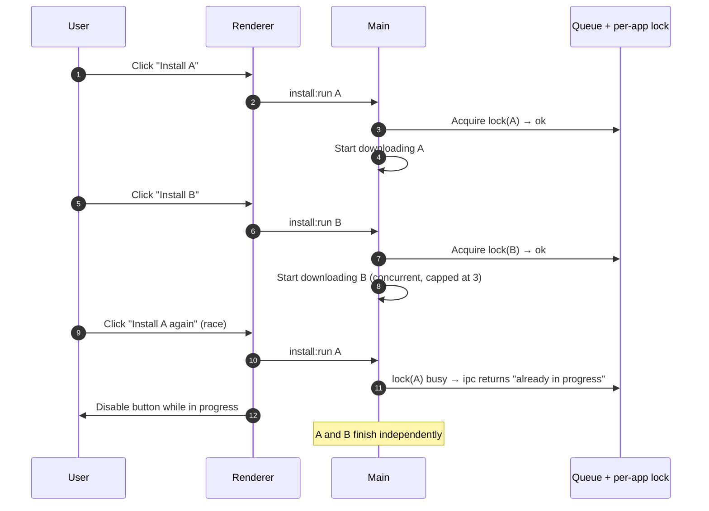
```mermaid
sequenceDiagram
    autonumber
    participant U as User
    participant R as Renderer
    participant M as Main
    participant Q as Queue + per-app lock

    U->>R: Click "Install A"
    R->>M: install:run A
    M->>Q: Acquire lock(A) → ok
    M->>M: Start downloading A
    U->>R: Click "Install B"
    R->>M: install:run B
    M->>Q: Acquire lock(B) → ok
    M->>M: Start downloading B (concurrent, capped at 3)
    U->>R: Click "Install A again" (race)
    R->>M: install:run A
    M->>Q: lock(A) busy → ipc returns "already in progress"
    R->>U: Disable button while in progress
    Note over M: A and B finish independently
```

---

## 14. Self-update available, user chooses "Restart now"

> Main spec: §5.1

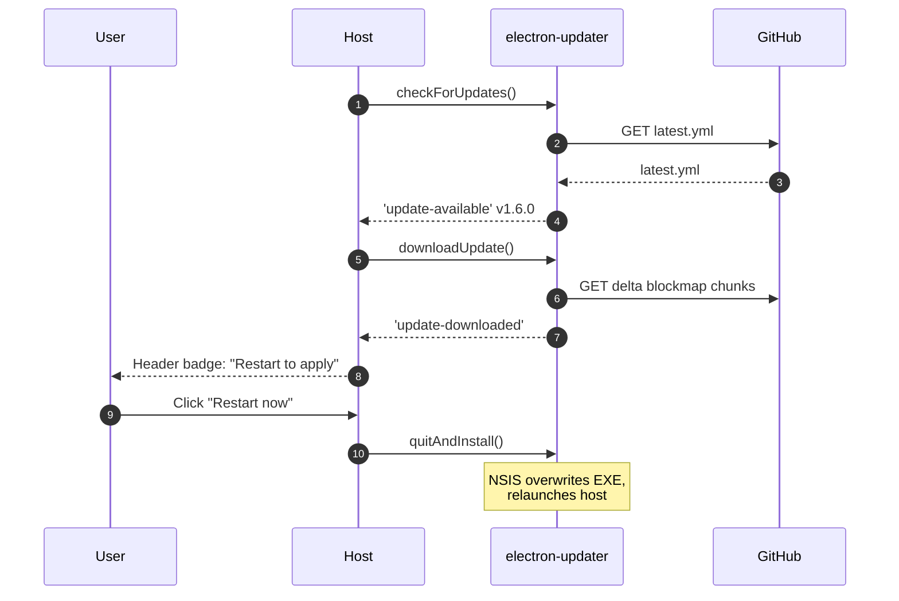
```mermaid
sequenceDiagram
    autonumber
    participant U as User
    participant H as Host
    participant Eu as electron-updater
    participant GH as GitHub

    H->>Eu: checkForUpdates()
    Eu->>GH: GET latest.yml
    GH-->>Eu: latest.yml
    Eu-->>H: 'update-available' v1.6.0
    H->>Eu: downloadUpdate()
    Eu->>GH: GET delta blockmap chunks
    Eu-->>H: 'update-downloaded'
    H-->>U: Header badge: "Restart to apply"
    U->>H: Click "Restart now"
    H->>Eu: quitAndInstall()
    Note over Eu: NSIS overwrites EXE,<br/>relaunches host
```

---

## 15. App process running during update

> Main spec: §5.4

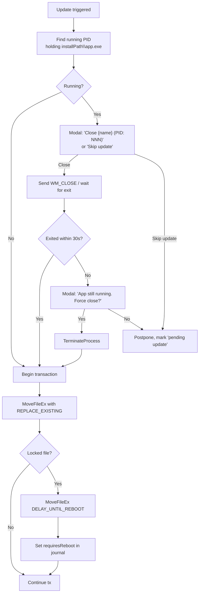
```mermaid
flowchart TD
    Start[Update triggered] --> Detect[Find running PID<br/>holding installPath\\app.exe]
    Detect --> Any{Running?}
    Any -->|No| Apply[Begin transaction]
    Any -->|Yes| Modal["Modal: 'Close {name} (PID: NNN)'<br/>or 'Skip update'"]
    Modal -->|Close| Wait[Send WM_CLOSE / wait for exit]
    Wait --> Confirm{Exited within 30s?}
    Confirm -->|Yes| Apply
    Confirm -->|No| Force["Modal: 'App still running. Force close?'"]
    Force -->|Yes| Kill[TerminateProcess]
    Force -->|No| Skip
    Kill --> Apply
    Modal -->|Skip update| Skip[Postpone, mark 'pending update']
    Apply --> Replace[MoveFileEx with REPLACE_EXISTING]
    Replace --> RebootNeed{Locked file?}
    RebootNeed -->|No| Continue[Continue tx]
    RebootNeed -->|Yes| Delay[MoveFileEx DELAY_UNTIL_REBOOT]
    Delay --> SetReb[Set requiresReboot in journal]
    SetReb --> Continue
```

---

## 16. Manifest references missing payload file (validator)

> Main spec: §6.2, §16.2 `vdx-pack validate`

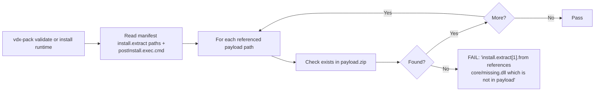
```mermaid
flowchart LR
    Start[vdx-pack validate or install runtime] --> Read[Read manifest install.extract paths +<br/>postInstall.exec.cmd]
    Read --> Iter[For each referenced payload path]
    Iter --> Check[Check exists in payload.zip]
    Check --> Found{Found?}
    Found -->|Yes| Next{More?}
    Found -->|No| Reject["FAIL: 'install.extract[1].from references<br/>core/missing.dll which is not in payload'"]
    Next -->|Yes| Iter
    Next -->|No| Pass[Pass]
```

---

## 17. requiresReboot completion

> Main spec: §5.4

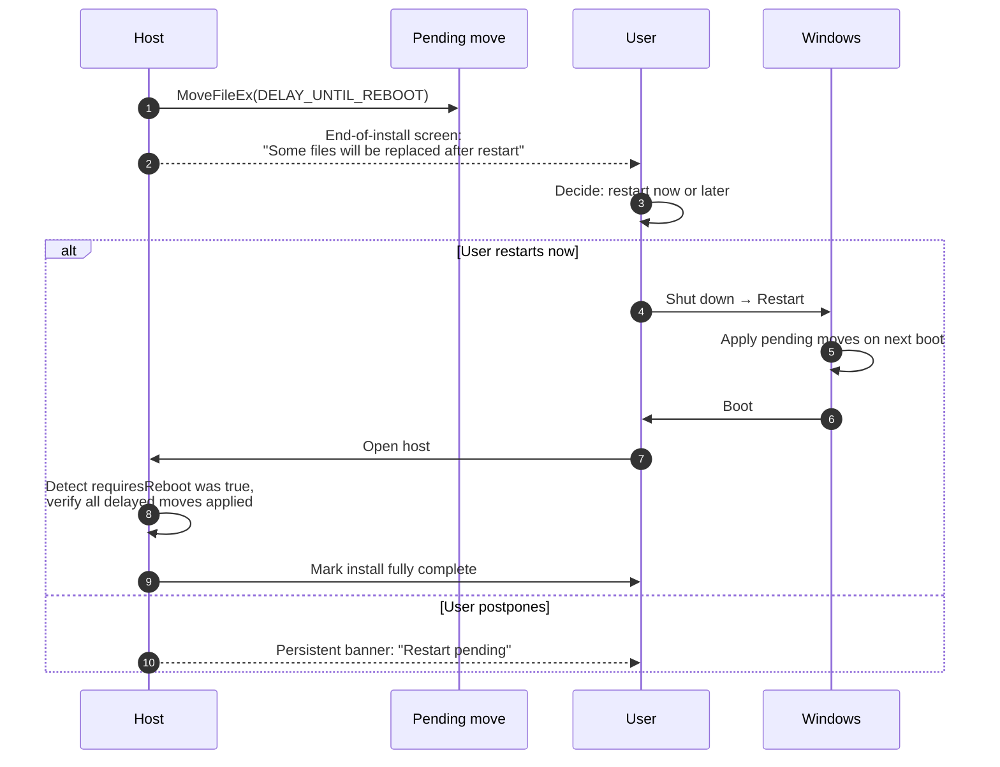
```mermaid
sequenceDiagram
    autonumber
    participant H as Host
    participant FS as Pending move
    participant U as User
    participant OS as Windows

    H->>FS: MoveFileEx(DELAY_UNTIL_REBOOT)
    H-->>U: End-of-install screen:<br/>"Some files will be replaced after restart"
    U->>U: Decide: restart now or later
    alt User restarts now
        U->>OS: Shut down → Restart
        OS->>OS: Apply pending moves on next boot
        OS->>U: Boot
        U->>H: Open host
        H->>H: Detect requiresReboot was true,<br/>verify all delayed moves applied
        H->>U: Mark install fully complete
    else User postpones
        H-->>U: Persistent banner: "Restart pending"
    end
```

---

## 18. Installer schema migration on upgrade

> Main spec: §21

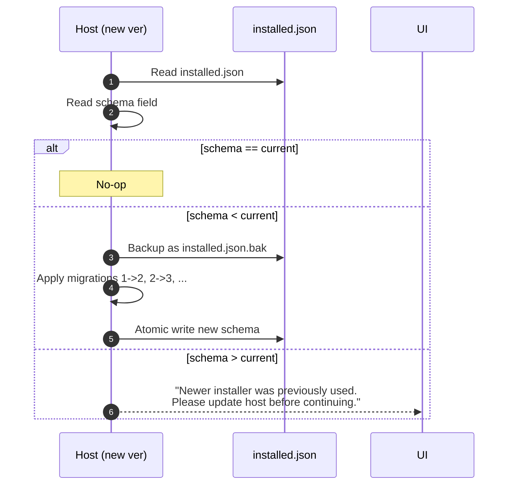
```mermaid
sequenceDiagram
    autonumber
    participant H as Host (new ver)
    participant State as installed.json

    H->>State: Read installed.json
    H->>H: Read schema field
    alt schema == current
        Note over H: No-op
    else schema < current
        H->>State: Backup as installed.json.bak
        H->>H: Apply migrations 1->2, 2->3, ...
        H->>State: Atomic write new schema
    else schema > current
        H-->>UI: "Newer installer was previously used.<br/>Please update host before continuing."
    end
```

---

## 19. Settings change: switch to internal channel

> Main spec: §5.2, §13.1

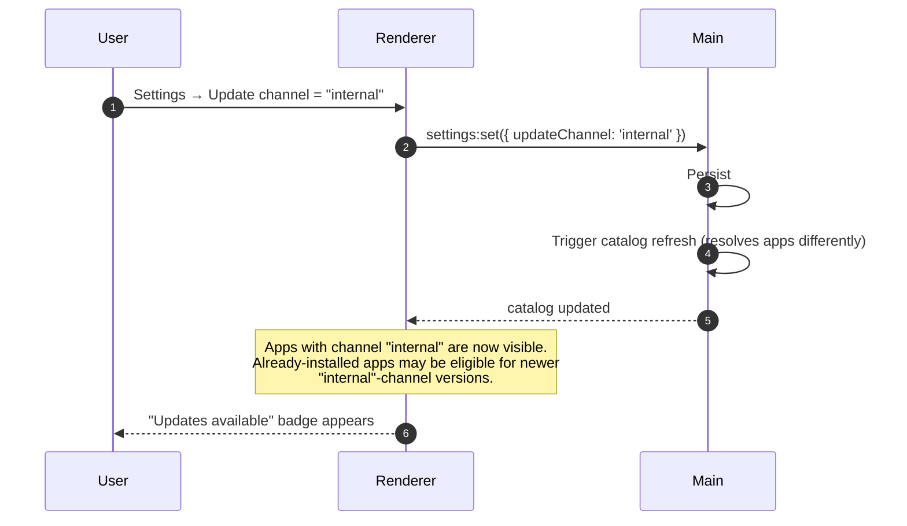
```mermaid
sequenceDiagram
    autonumber
    participant U as User
    participant R as Renderer
    participant M as Main

    U->>R: Settings → Update channel = "internal"
    R->>M: settings:set({ updateChannel: 'internal' })
    M->>M: Persist
    M->>M: Trigger catalog refresh (resolves apps differently)
    M-->>R: catalog updated
    Note over R: Apps with channel "internal" are now visible.<br/>Already-installed apps may be eligible for newer<br/>"internal"-channel versions.
    R-->>U: "Updates available" badge appears
```

---

## 20. Diagnostics export

> Main spec: §11.2

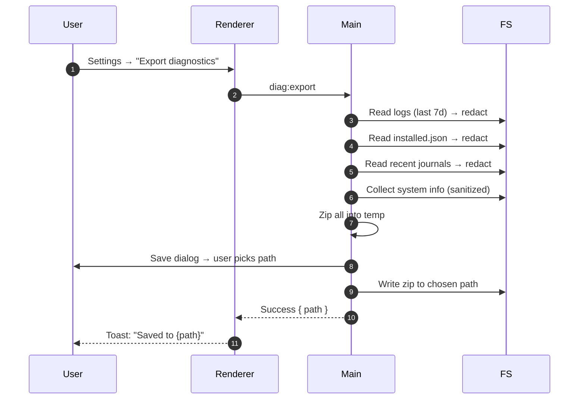
```mermaid
sequenceDiagram
    autonumber
    participant U as User
    participant R as Renderer
    participant M as Main
    participant FS as FS

    U->>R: Settings → "Export diagnostics"
    R->>M: diag:export
    M->>FS: Read logs (last 7d) → redact
    M->>FS: Read installed.json → redact
    M->>FS: Read recent journals → redact
    M->>FS: Collect system info (sanitized)
    M->>M: Zip all into temp
    M->>U: Save dialog → user picks path
    M->>FS: Write zip to chosen path
    M-->>R: Success { path }
    R-->>U: Toast: "Saved to {path}"
```

---

## 21. App with EULA declared

> Main spec: §3.2 `wizard.license`

```mermaid
flowchart TD
    Start[Install begins] --> EULA{License step<br/>declared?}
    EULA -->|No| Path[Path step]
    EULA -->|Yes| Show[Show EULA from payload<br/>or text in manifest]
    Show --> Read[User scrolls to bottom]
    Read --> Accept{User accepts?}
    Accept -->|No| Cancel[Install cancelled,<br/>no state changes]
    Accept -->|Yes| Path
    Path --> Wiz[Continue wizard]
```

---

## 22. Disk space pre-check

> Main spec: §19

```mermaid
flowchart TD
    Start[After wizard summary, before download] --> Read[Read free bytes<br/>on installPath drive]
    Read --> Need[Required = manifest.size.installed × 2]
    Need --> Cmp{Free ≥ Required?}
    Cmp -->|Yes| Proceed[Proceed]
    Cmp -->|No| Modal["Modal: 'Not enough disk space.<br/>Free: 1.2 GB, needed: 4.0 GB'<br/>Suggest: Settings → Clear cache"]
    Modal --> Cancel[Cancel install]
```

---

## 23. Catalog repository registration PR (CI flow)

> Main spec: §16.4

```mermaid
sequenceDiagram
    autonumber
    participant Dev as App team
    participant PR as PR to vdx-catalog
    participant CI as Catalog CI
    participant Rev as Reviewer
    participant Cat as catalog.json
    participant Sign as vdx-signing-service

    Dev->>PR: Add { id, repo } to apps[]
    PR->>CI: Trigger
    CI->>CI: Fetch latest release of new repo
    CI->>CI: Verify manifest signature
    CI->>CI: Verify id uniqueness
    CI->>CI: vdx-pack validate against fetched manifest
    alt Pass
        CI-->>PR: ✅
    else Fail
        CI-->>PR: ❌ with errors
    end
    PR->>Rev: Human review
    Rev->>PR: Approve + merge
    PR->>CI: Post-merge job:
    CI->>Sign: Re-sign catalog.json
    Sign-->>CI: catalog.json.sig
    CI->>Cat: Commit signed pair
    Cat-->>HostsWorld: Next refresh, new app visible
```

---

## 24. Bandwidth limit applied during download

> Main spec: §9.1, §13.1

```mermaid
sequenceDiagram
    autonumber
    participant M as Main
    participant Bk as Token bucket
    participant Net as undici
    participant FS as FS

    M->>Bk: Configure: rate = 1 MB/s (from settings)
    M->>Net: GET payload.zip
    loop For each chunk
        Net-->>M: bytes received
        M->>Bk: Request tokens
        Bk-->>M: Wait until tokens available
        M->>FS: Append chunk to .partial
    end
    Note over M: Effective transfer ≤ rate; UI shows actual throughput
```

---

## 25. Localized rendering decision

> Main spec: §12

```mermaid
flowchart TD
    Start[Render any localized field e.g. manifest.name] --> Curr[currentLang from settings]
    Curr --> Has{Field has key for<br/>currentLang?}
    Has -->|Yes| Use[Use that string]
    Has -->|No| Def{Field has 'default'?}
    Def -->|Yes| Use2[Use 'default']
    Def -->|No| Validate["Validator should have rejected this manifest;<br/>show '(missing translation)' as visible defect"]
```

---

## Appendix A — Diagram conventions

- **Sequence diagrams** use `autonumber`. The numbers correspond to the chronological order of events.
- **Solid arrows** are direct calls / messages. **Dashed arrows** are notifications, async events, or "applied by".
- **Participants** are colored by trust band where it matters (red = elevated, blue = standard user, green = network).
- **Diamond nodes** are decision points; the labels on outgoing edges are the conditions.
- **States** are nouns ("Pending"); transitions are verbs ("Begin transaction").

---

## Appendix B — Where to look first

| If you're investigating… | Start with |
|---|---|
| Why an install failed half-way | §8 Crash mid-install |
| Why an update did or didn't ask the user | §2 / §3 Wizard reuse |
| Why a download keeps retrying | §4 Network drop / §11 Catalog refresh |
| Why an exec action was skipped | §7 exec hash |
| Why a corporate user can't reach catalog | §10 Proxy + PAT |
| Why "Apps & features" uninstalls work | §12 |
| What the developer sees when packaging | §23 + main spec §16 |
